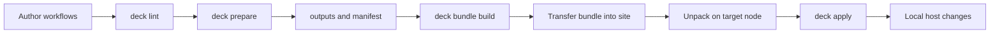
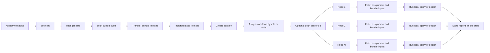

# Architecture

This document explains how `deck` is put together at a system level.

`deck` is not designed as a general-purpose IaC control plane. It is a local-first workflow tool for air-gapped and operationally constrained environments. The architecture reflects that: prepare work happens on the connected side, the offline handoff is a bundle, and host changes happen locally on the target machine.

## What this document covers

- the main system boundaries
- the end-to-end flow from authoring to local execution
- the role of the bundle, the local server, and the site store
- the safety and trust-boundary model that shapes the implementation

For workflow fields, CLI flags, and bundle layout details, see the reference docs.

## System boundaries

`deck` operates across four practical boundaries:

- **Connected environment**: where workflows are authored, linted, and prepared. This side can fetch packages, files, and images.
- **Transfer boundary**: the point where prepared content is packaged and moved into the air gap.
- **Air-gapped site**: where the operator has the bundle and may optionally run a local `deck server`.
- **Target node**: the machine where `deck apply` makes host changes locally.

This separation is deliberate. The connected side resolves external dependencies. The site side should not have to.

## End-to-end flow

The normal operating model is:

1. Write workflows under `workflows/`.
2. Run `deck lint` in the connected environment.
3. Run `deck prepare` to collect packages, images, and files into `outputs/`.
4. Run `deck bundle build` to create the handoff artifact.
5. Move the bundle into the site.
6. Unpack it and run `deck apply` locally on the target node.

Optional site-local helpers such as `deck server up` can expose prepared content over HTTP inside the air gap, but they do not replace the default local execution path.

## Single-node flow

The simplest `deck` workflow is a single operator preparing a bundle in a connected environment, moving it into the site, and running it directly on one target node.

This is the default path the rest of the architecture is built around. It keeps the execution model small: one prepared bundle, one local binary, and one target machine applying a typed workflow.

## Multi-node flow

When the site needs to coordinate work across multiple nodes, `deck` can add a site-local release and assignment flow. The central idea is still local execution, but the site can use a shared bundle root and local coordination state.

Even in this model, `deck` is not acting as a central reconciliation controller. The server and site store help distribute prepared content and keep local coordination state, but each node still executes its assigned workflow locally.

## Why prepare and apply are separate

The split between `prepare` and `apply` is the center of the architecture.

- **Prepare** resolves network-dependent inputs while connectivity is available.
- **Apply** performs host mutation locally without assuming internet access, SSH, PXE, or a long-lived controller.

That separation keeps the offline side simpler to reason about. By the time `apply` runs, the workflow and its required artifacts should already be present.

## Why the bundle is the handoff unit

The bundle is the explicit contract between the connected side and the site.

It carries:

- the `deck` binary
- workflow files
- prepared outputs such as packages, images, and files
- the manifest used for integrity checks

Using a bundle as the handoff unit avoids implicit runtime dependencies. If the site needs it, it should be in the bundle or intentionally provided by the local environment.

## Core components

At a high level, the system is made of a few distinct parts.

- **CLI entrypoints**: command parsing and user-facing command flow under `cmd/`
- **Workflow model and validation**: typed workflow contracts, schema generation, and validation logic
- **Prepare engine**: connected-side artifact collection and workflow rendering
- **Apply engine**: local execution and host mutation on the target node
- **Bundle lifecycle**: collecting, packaging, importing, and verifying bundle contents
- **Site store**: release, session, assignment, and execution-report state kept locally at the site
- **Optional local server**: site-local HTTP helper for bundle browsing, scenario inspection, and report ingestion

These parts are related, but they are intentionally not collapsed into one large runtime.

## Typed workflows as the center

`deck` prefers typed steps over shell-heavy procedures.

That design choice is architectural, not cosmetic.

- typed steps make workflows easier to review
- typed steps are easier to validate before crossing the air gap
- typed steps let `deck` enforce clearer boundaries around filesystem access, command execution, and runtime outputs
- typed steps make future behavior changes easier than growing a library of shell fragments

`Command` remains available as an escape hatch, but it is not meant to be the dominant authoring style.

Another reason for this design is to reduce user confusion. `deck` tries to give common operational work one clear typed shape instead of several overlapping ways to express the same action. That makes workflows easier to review, easier to teach, and easier to evolve without growing a large compatibility surface.

The goal is not to model every edge immediately. The goal is to keep the main path simple enough that operators can usually predict which step kind to reach for and what behavior it implies.

## Command surface design

The CLI follows the same simplification goal.

`deck` tries to keep the command surface organized around a small number of lifecycle stages:

- author and validate workflows
- prepare artifacts and bundle inputs
- build and verify the bundle
- execute locally on the target node
- optionally coordinate site-local distribution and reporting

This is why the command tree stays intentionally small and role-oriented rather than offering many overlapping entrypoints for similar behavior.

The intent is to reduce operator hesitation and avoid a tool shape where several commands appear to solve the same problem with slightly different assumptions. A smaller command model makes the default path clearer and helps keep help text, examples, and documentation aligned.

## Local-first execution model

`deck` is designed so the default execution path is local.

- no SSH requirement
- no always-on central controller
- no requirement to bootstrap a separate automation runtime on every node beyond the `deck` binary and the bundle contents

This is especially important for constrained environments where even localhost-oriented orchestration tools can create packaging or dependency overhead that is harder to carry than the procedure itself.

## Site-local coordination model

When the optional site-local workflow is used, `deck` keeps coordination state in a local store.

That state includes:

- **releases**: imported or prepared bundle versions available at the site
- **sessions**: execution windows or rollout instances tied to a release
- **assignments**: per-node work selection for a session and action
- **execution reports**: node-reported outcomes stored locally for inspection
- **audit logs**: server-side lifecycle and request records

This model keeps coordination local to the site rather than depending on an external control plane.

## Safety and trust boundaries

Recent refactoring pushed `deck` toward helper-local trust boundaries.

The goal is simple: feature code should describe intent, while sensitive operations stay localized in small helper layers.

Important trust boundaries include:

- **filesystem path resolution**: rooted path helpers constrain how paths are resolved within bundle, site, and state roots
- **host path mutation**: host-oriented path writes stay explicit rather than being mixed into generic path handling
- **file mode policy**: common permission patterns are centralized instead of open-coded everywhere
- **command execution**: execution helpers separate workflow-driven commands from broader system-level capabilities
- **HTTP response and template rendering**: server output is localized in small response/template helpers

This makes the codebase easier to audit and reduces the need for broad security suppressions in feature code.

## Failure domains

The architecture also tries to keep failures local to the stage that caused them.

- **Lint or schema failure** stops the workflow before preparation or execution.
- **Prepare failure** means the connected side did not produce a complete offline handoff.
- **Bundle verification failure** means the transferred content cannot be trusted as-is.
- **Apply failure** affects the target node execution path, not the connected-side artifact pipeline.
- **Server failure** affects optional site-local helper behavior, not the core local apply model.

This keeps the system easier to recover and reason about during real operations.

## What `deck` is not

`deck` intentionally does not aim to be:

- a generic cloud provisioning framework
- a long-lived reconciliation controller
- an SSH-first orchestration tool
- a replacement for every existing IaC or CM system

It is a structured workflow runner for a narrower class of operational problems, especially where disconnected execution and explicit handoff matter more than broad platform coverage.

## How the codebase maps to the architecture

The code layout roughly follows these boundaries:

- `cmd/`: CLI entrypoints
- `internal/config` and `internal/workflowexec`: workflow contracts, decoding, and execution rules
- `internal/prepare` and `internal/preparecli`: connected-side preparation logic
- `internal/install`: target-side host mutation and apply behavior
- `internal/bundle`: bundle collection, import, merge, and verify logic
- `internal/site/store`: site-local state model
- `internal/server`: optional site-local HTTP server
- `internal/fsutil`, `internal/filemode`, `internal/hostfs`, `internal/executil`: safety-oriented helper boundaries

The exact package layout may continue to evolve, but the architectural direction stays the same: thin CLI layer, typed workflow boundary, explicit trust boundaries, and minimal hidden behavior.

## Extending the system

New capabilities should follow the same shape.

- prefer adding a typed step over expanding `Command` usage
- keep runtime side effects in focused helper boundaries
- keep prepare-side network work out of apply-side host mutation paths
- document workflow and schema changes together
- keep the default path local-first even when optional server features expand

## Related references

- `docs/concepts/why-deck.md`
- `docs/reference/workflow-model.md`
- `docs/reference/bundle-layout.md`
- `docs/reference/cli.md`
