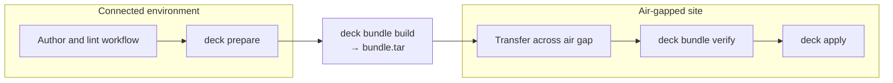

# The deck lifecycle

`deck` organizes every operation into three explicit stages: **prepare** (connected), **bundle** (the sealed handoff unit), and **apply** (air-gapped). Understanding this lifecycle is the fastest way to build a working mental model of the tool.

## The three stages



**Prepare** runs in a connected environment. The operator authors a typed workflow, lints it, then runs `deck prepare` to download packages, images, and files into the workspace's `outputs/` tree. Preparation is declared through the same typed workflow model used for apply — there is no separate ad hoc download script.

**Bundle** turns the prepared workspace into a single, self-contained archive (`bundle.tar`). The binary, all workflow files, all prepared artifacts, and the integrity manifest are packed together. After this step, no external connectivity is required.

**Apply** runs locally on the target node inside the air gap. The operator unpacks the bundle, optionally verifies it with `deck bundle verify`, then runs `deck apply`. The workflow executes entirely on the node using only what the bundle contains — no SSH, no controller, no reach-back.

## What lives in a bundle and why

| Bundle path | Purpose |
|---|---|
| `deck` | Launcher script; selects the platform-specific binary from `outputs/bin/` |
| `outputs/bin/<os>/<arch>/deck` | The deck runtime binary for offline execution — no installation required on the target |
| `workflows/` | Scenario, component fragment, and variable files — the workflow the operator will run |
| `outputs/files/` | Files downloaded or staged during prepare (config files, binaries, etc.) |
| `outputs/packages/` | OS packages (`.rpm`, `.deb`, Kubernetes packages) fetched during prepare |
| `outputs/images/` | Container image archives fetched during prepare |
| `.deck/manifest.json` | SHA-256 integrity manifest; `deck bundle verify` and `deck apply` both check this before any work begins |

Everything the workflow needs on the target machine must be inside the bundle. If a step needs a file at apply time, it should come from `outputs/` — the target node should not need to reach back to any external source.

## Workspace vs. bundle

This is the most common point of confusion.

A **workspace** is your authoring directory — the live directory you work in before bundling. It is created by `deck init` and has the standard `workflows/`, `outputs/`, and `.deck/` layout. The workspace evolves as you edit workflows, run `prepare`, and iterate. See [Workspace Layout](../workspace-layout.md) for the full structure.

A **bundle** is the sealed, transportable artefact produced by `deck bundle build`. It is a single `bundle.tar` archive (or, after extraction on the target, the unpacked bundle root directory). Once built, the bundle is treated as immutable: the integrity manifest is checked before apply begins. See [Bundle Layout](../bundle-layout.md) for the exact contents and verification rules.

| | Workspace | Bundle |
|---|---|---|
| State | Mutable — you author and prepare here | Immutable — sealed for transport |
| Location | Connected environment | Crosses the air gap |
| Created by | `deck init` | `deck bundle build` |
| Used by | `deck lint`, `deck prepare` | `deck bundle verify`, `deck apply` |

## The role split

`deck` divides workflow logic across three distinct roles in the `workflows/` directory:

- **`workflows/prepare.yaml`** — the prepare workflow. Runs on the connected side. Declares what must be fetched before crossing the air gap: packages, images, files, and binaries.
- **`workflows/scenarios/`** — scenario files. Each is a complete apply workflow that describes a real operational task (for example, `apply.yaml`, `bootstrap.yaml`, `worker-join.yaml`). Scenarios are the operator-facing entrypoints for `deck apply`.
- **`workflows/components/`** — component fragments. Reusable step lists that scenarios import. They contain only a `steps:` list and have no standalone entry role. Scenarios pull them in via `phases[].imports`.

A scenario imports components like this:

```yaml
# workflows/scenarios/apply.yaml
version: v1alpha1
phases:
  - name: host-prereqs
    imports:
      - path: k8s/prereq.yaml        # resolves to workflows/components/k8s/prereq.yaml
      - path: repo/offline-repo.yaml
  - name: runtime
    imports:
      - path: k8s/containerd-kubelet.yaml
```

The component file (`workflows/components/k8s/prereq.yaml`) contains only steps and is imported rather than run directly. This keeps shared logic in one place without coupling components to a particular scenario's variable shape.

## The operator's checklist before crossing the air gap

1. **Lint** — run `deck lint` (or `deck lint --workflow ./workflows/scenarios/apply.yaml`) to validate workflow structure and step schemas before investing time in preparation.
2. **Prepare** — run `deck prepare` from the workspace root to download all artifacts into `outputs/` and write `.deck/manifest.json`.
3. **Bundle build** — run `deck bundle build --out ./bundle.tar` to create the sealed archive.
4. **Verify (connected side, optional)** — run `deck bundle verify ./bundle.tar` before transport to confirm the archive is complete and the manifest is consistent.
5. **Transport** — carry `bundle.tar` across the air gap by whatever physical or one-way transfer method is available.
6. **Verify (target side)** — after unpacking, run `deck bundle verify <bundle-root>` to confirm integrity survived transport.
7. **Apply** — run `deck apply` (or `deck apply --scenario <name>`) from the bundle root. The manifest is checked automatically before any phase begins.

## Related references

- [Workspace Layout](../workspace-layout.md)
- [Bundle Layout](../bundle-layout.md)
- [Workflow Model](../workflow-model.md)
- [Quick start](../quick-start.md)
- [Offline Kubernetes tutorial](../offline-kubernetes.md)
