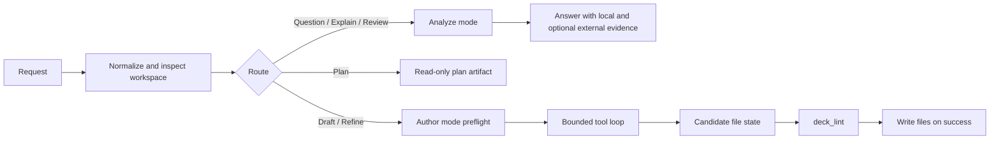

# deck ask

`deck ask` is an experimental workflow assistant for the current workspace. It can answer questions, explain or review existing workflow files, create new workflow YAML, and refine an existing workflow when the request is clearly authoring work.

`ask` ships as part of the standard `deck` binary.

For kubeadm authoring, the most reliable starter prompt today is explicit about topology, for example `single-node`. Generic `cluster` wording is more likely to trigger a clarification.

## What `deck ask` does

`deck ask` routes each request based on intent:

- `question`: answer a direct workflow question
- `explain`: explain what an existing file or workflow does
- `review`: review the current workspace and call out practical issues
- `draft`: create a new workflow or scenario shape
- `refine`: modify an existing workflow

Use `--create` or `--edit` when you want to make authoring intent explicit. Use `deck ask plan` when you want a saved plan artifact without writing workflow files yet.

For command-level syntax and subcommands, see [CLI Reference](../reference/cli.md).

Contributors working on the internal pipeline should see [Ask Agent Runtime](../contributing/ask-agent-runtime.md). For background on why the runtime looks this way, see [Ask History](../contributing/ask-history.md).

## How it works

`deck ask` now uses a split runtime: read-only analysis for answer-oriented requests, and a bounded authoring runtime for create/edit work.



### Step 1: Normalize and route the request

`deck ask` first loads the prompt, current workspace, saved ask config, optional `--from` content, and route flags such as `--review`, `--create`, and `--edit`.

If the route is not forced by flags, `deck ask` classifies the request into one of the normal ask routes. If the request is too ambiguous to classify safely, it asks for clarification instead of guessing.

### Step 2: Analyze mode stays read-only

`question`, `explain`, `review`, and `plan` stay on a read-only path.

That path can use:

- workspace files from the current repo
- deck-owned local facts about workflow rules and behavior
- optional external evidence when the request needs fresh upstream facts

These routes return an answer or a saved plan artifact. They do not write workflow files.

### Step 3: Author mode works on real files through tools

When a request resolves to `draft` or `refine`, `deck ask` switches to the bounded authoring runtime.

Before the model can edit anything, code performs preflight work to decide:

- which files are in scope
- whether the request is blocked on a real missing detail
- whether refine may touch companion files in addition to the anchor file
- whether an empty workspace needs initial scaffold state

The model then works through a small tool set over the real workspace:

- `glob`
- `read`
- `file_write`
- `file_edit`
- `init`
- `validate`
- `mcp_web_search` when external evidence is allowed and needed

`file_write` and `file_edit` do not write workflow files to disk immediately. They update session-owned candidate state first, then `deck ask` writes files only after the session finishes successfully. In an empty workspace, the authoring runtime may call its internal `init` tool first; that tool prepares only the minimal directories, ignore files, and output `.keep` files needed for generated workflow files. It does not run full `deck init` or create starter workflow templates.

### Step 4: Lint gates the final write

Author mode keeps iterating until one of these happens:

- `deck_lint` succeeds and the model finishes
- `deck ask` detects a true blocker and asks for clarification
- the session reaches its turn budget

This keeps validation and scope enforcement in code. A finish signal is rejected until the current candidate state passes lint.

Session transcripts and tool results are saved under `./.deck/ask/`, including `./.deck/ask/last-agent-session.json` for debugging.

### Step 5: External evidence is optional and bounded

`deck ask` still distinguishes between deck-owned workflow truth and upstream product facts.

- local deck facts stay authoritative for workflow paths, schema, typed steps, and validation behavior
- external evidence is for fresh upstream facts such as install steps, compatibility, version-specific guidance, or troubleshooting

In analyze mode, external evidence may be gathered up front when policy requires it. In author mode, external lookup is exposed as an optional in-loop tool instead of being prefetched for every run.

### Step 6: `plan` stays read-only

`deck ask plan` shares the front of the pipeline with normal requests: it understands the prompt, inspects the workspace, and surfaces blockers or clarifications.

The difference is that `plan` stops at a saved implementation artifact under `./.deck/plan/` instead of writing workflow files. This is the safer path for large or ambiguous requests.

## Configure provider and model

Save default settings once:

```bash
deck ask config set \
  --provider openai \
  --model gpt-5.4 \
  --endpoint https://api.openai.com/v1 \
  --api-key "$DECK_ASK_API_KEY"
```

Inspect the effective config:

```bash
deck ask config show
```

Clear saved settings:

```bash
deck ask config unset
```

Supported providers currently include:

- `openai`
- `openrouter`
- `gemini`

You can also override `provider`, `model`, and `endpoint` per command instead of saving them globally.

## OpenAI OAuth session commands

If you use the OpenAI provider, `deck` also supports a saved local OAuth session alongside static API-key configuration.

Inspect whether a saved session is available:

```bash
deck ask status --provider openai
```

Start login in a browser flow:

```bash
deck ask login --provider openai
```

Headless environments can use device login or import a token directly:

```bash
deck ask login --provider openai --headless
printf '%s' "$OPENAI_OAUTH_TOKEN" | deck ask login --provider openai --stdin-token
```

Remove the saved session:

```bash
deck ask logout --provider openai
```

OAuth session commands are provider-specific helpers. They do not replace `ask config set` for choosing the provider, model, endpoint, or evidence settings.

## Configure external evidence providers

Inspect the effective provider setup:

```bash
deck ask config show
```

Probe provider health and capability support:

```bash
deck ask config health
```

Example config using built-in providers:

```json
{
  "ask": {
    "provider": "openai",
    "model": "gpt-5.4",
    "mcp": {
      "enabled": true,
      "servers": [
        { "name": "context7" },
        { "name": "web-search" }
      ]
    }
  }
}
```

Optional transport override example:

```json
{
  "ask": {
    "mcp": {
      "enabled": true,
      "servers": [
        {
          "name": "context7",
          "command": "npx",
          "args": ["-y", "@upstash/context7-mcp@latest"]
        }
      ]
    }
  }
}
```

## Common usage patterns

Ask a direct question:

```bash
deck ask "what does workflows/scenarios/apply.yaml do?"
```

Explain an existing workflow file:

```bash
deck ask "explain what workflows/scenarios/apply.yaml does"
```

Review the current workspace:

```bash
deck ask --review
```

Draft a new workflow:

```bash
deck ask --create "create an air-gapped rhel9 single-node kubeadm workflow"
```

Refine an existing workflow:

```bash
deck ask --edit "add containerd configuration to the apply workflow"
```

Use a request file:

```bash
deck ask --from ./request.md
deck ask --create --from ./request.md
```

If `deck ask` replies with a clarification, add the missing detail or use an explicit route flag:

```bash
deck ask --create "create a two-node offline kubeadm workflow"
deck ask --edit "refactor workflows/scenarios/apply.yaml to use workflows/vars.yaml"
deck ask --review "review workflows/scenarios/apply.yaml for offline issues"
```

## Plan mode

Use `deck ask plan` when the request is too large or ambiguous for a good one-shot edit:

```bash
deck ask plan "air-gapped rhel9 kubeadm cluster with prepare/apply split"
```

Plan artifacts are written under `./.deck/plan/` by default. A common follow-up flow is:

```bash
deck ask plan --from .deck/plan/latest.json --answer topology.kind=multi-node
deck ask plan --from .deck/plan/latest.json --answer topology.roleModel=1cp-2workers
deck ask --from .deck/plan/latest.md "implement this plan"
```

When the request still has blockers or unresolved clarifications, `deck ask` may stop after planning instead of writing weak workflow output. Resume from the saved plan artifact with `--answer key=value` until the blocking clarifications are resolved.

## Workspace and files

- `deck ask` works against the current workspace by default.
- Ask session state lives under `./.deck/ask/`.
- Saved ask config defaults live under `~/.config/deck/config.json` as the top-level `ask` object.
- Generated workflow files stay within the normal deck workflow tree such as `workflows/prepare.yaml`, `workflows/scenarios/`, `workflows/components/`, and `workflows/vars.yaml`.

## Diagnostics and troubleshooting

`ask.logLevel` controls terminal diagnostics on stderr:

- `basic`: route and provider summary
- `debug`: `basic` plus the user command and MCP events
- `trace`: `debug` plus classifier and route prompt text

Set it with:

```bash
deck ask config set --log-level trace
```

Use `trace` when you need to inspect route selection, clarification behavior, or external evidence setup.

For external evidence setup, `deck ask config health` is the quickest way to distinguish:

- transport start failures
- MCP initialize failures
- tool-list mismatches
- missing required provider capabilities

If a freshness-sensitive request fails because required external evidence is unavailable, fix the provider configuration first and rerun the request.

## Current limitations

- `deck ask` is experimental.
- It depends on model access for authoring routes.
- `explain` and `review` have limited local fallbacks when model access is unavailable.
- Authoring routes fail fast when model output is unavailable because local validation cannot replace generation.
- Freshness-sensitive requests may also fail fast when required external evidence is unavailable.
- `--max-iterations` only applies to generation routes such as `draft` and `refine`.
