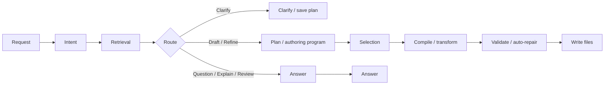

# deck ask

`deck ask` is an experimental authoring helper for working with deck workflows from the current workspace. It can answer questions about an existing workflow, explain or review files, propose changes, and draft workflow YAML when the request is clearly an authoring task.

`ask` ships as part of the standard `deck` binary.

For kubeadm authoring, the most reliable starter prompt today is explicit about topology, for example `single-node`. Generic `cluster` wording is more likely to trigger plan-time ambiguity checks.

## What `deck ask` does

`deck ask` uses the current workspace as context and routes each request based on intent:

- question: answer a direct workflow question
- explain: explain what an existing file or workflow does
- review: review the current workspace and call out practical issues
- draft: create a new workflow or scenario shape
- refine: modify an existing workflow

Authoring routes write workflow files directly. Use `deck ask plan` when you want a saved plan artifact without applying workflow changes yet.

For command-level syntax and subcommands, see [CLI Reference](../reference/cli.md).

## How it works

`deck ask` follows a routed pipeline instead of treating every request like workflow generation.



For authoring routes, the important rule is: the model selects, code assembles. `deck ask` does not treat model output as final workflow YAML. It builds an internal plan, derives an executable authoring program, asks the model for constrained selections, then compiles and validates the resulting workflow documents.

### Step 1: Normalize the request

`deck ask` starts by normalizing the input request and loading the current workspace. This includes the prompt text, optional `--from` content, saved ask config, explicit route flags such as `--review`, `--create`, and `--edit`, and whether the workspace already has files such as `workflows/prepare.yaml`, `workflows/scenarios/apply.yaml`, or `workflows/vars.yaml`.

This early inspection matters because `deck ask` behaves differently in an empty workspace than it does in an existing workflow tree.

### Step 2: Classify the request

Before it decides whether to generate files, `deck ask` classifies the request into a route. Hard overrides such as `--review`, `--create`, and `--edit` bypass route classification. All other normal requests go through LLM-assisted route classification first.

- `question`: answer a direct question
- `explain`: explain an existing file or workflow
- `review`: review the current workspace and call out issues
- `draft`: create a new workflow or scenario
- `refine`: modify an existing workflow

This is the key branching point in the pipeline. Requests such as "what does this workflow do?" should go to explanation, not file generation. Requests such as "add containerd setup" should go to authoring. If the classifier cannot safely distinguish between explain/review/create/edit, `deck ask` falls back to `clarify` and asks for a more explicit request or a route flag.

### Step 3: Retrieve deck-specific context

After routing, `deck ask` gathers the context needed for that request. The retrieved context can include:

- workflow files from the current workspace
- built-in deck authoring knowledge about workflow topology, components, vars, and step usage
- route-specific guidance for typed steps
- saved local state such as the last lint summary when available

This is where `deck ask` becomes more than a generic model wrapper. It does not rely only on the user's sentence. It combines the sentence with deck's workflow rules and with the actual workspace contents.

For authoring, that context includes projected source-of-truth information about typed steps, fields, and canonical workflow paths. Those facts come from deck's schema and step metadata layers rather than from a separate ask-only schema.

### Step 4: Build the authoring plan

For `draft` and `refine`, `deck ask` turns the request and retrieved context into an internal plan. That plan is not just advisory text. It acts as the execution contract for generation and helps decide things such as:

- whether the request assumes offline or air-gapped execution
- which files are likely needed
- whether the target looks like a prepare flow, apply flow, or a split prepare/apply workflow
- how strict the generated output needs to be to satisfy the request
- which topology and role facts later compilation will rely on
- which companion files are allowed for refine

Non-authoring routes do not go through this stage because they return an answer rather than candidate files. Authoring routes now always build an internal plan first, even when you do not run `deck ask plan` explicitly.

Part of that plan is an authoring program: normalized platform, artifact, cluster, and verification facts that code can later use when assembling workflow steps. This is how details such as node counts, role selectors, join-file paths, output directories, and verification expectations stay consistent across generation and repair.

### Step 5: Clarify or continue

For authoring routes, `deck ask` checks whether the plan is strong enough to execute. If required details are still missing, it asks clarification questions before generation starts. In an interactive terminal, these clarification questions happen inline. In non-interactive environments, `deck ask` saves a plan artifact and tells you how to resume.

Clarification is part of the normal pipeline, not a fallback after a bad generation attempt. If the request is ambiguous about topology, execution role layout, refine scope, or supported coverage, `deck ask` blocks authoring until that ambiguity is resolved.

### Step 6: Select candidates, then compile

Once the plan is strong enough, `deck ask` moves into constrained authoring:

- for `draft`, the model selects validated builder candidates and allowed override values
- for `refine`, code computes transform candidates from parsed workflow structure and the model selects among those candidates

Code then assembles or transforms workflow documents from those selections.

That compilation step uses deck source-of-truth metadata and canonical workspace rules to decide where documents belong and how required fields should be filled. Instead of asking the model to invent low-level step payloads from scratch, `deck ask` compiles toward canonical files such as `workflows/prepare.yaml`, `workflows/scenarios/`, `workflows/components/`, and `workflows/vars.yaml`.

Route output still differs by route:

- answer text for `question`, `explain`, and `review`
- compiled workflow files for `draft` and `refine`

### Step 7: Validate and auto-repair

When `deck ask` generates files, it validates the result against deck's rules. That includes generated path checks, YAML shape checks, and workflow/schema validation.

If validation fails, `deck ask` uses structured diagnostics to run a repair pass. Those diagnostics help it target the exact file, field, or shape mismatch instead of retrying blindly.

Repair is automatic first. When the validator reports a missing required field, invalid literal, or similar structured issue, code tries to repair it from the same source-of-truth projection and authoring program used during compilation. Model involvement is reserved for cases where multiple valid repair choices remain.

This validation-and-repair loop is one of the main reasons generated output is more reliable than a single unvalidated model response.

### Step 8: Write files or save the plan

Authoring routes now write workflow files directly once planning, generation, validation, and repair succeed. If you want to stop after planning, use `deck ask plan` and resume from the saved artifact later.

Route behavior differs at the end of the pipeline:

- `question`, `explain`, and `review` return answer-oriented output and do not generate workflow files
- `draft` and `refine` write workflow files directly after successful validation
- use `--create` or `--edit` when you want to make authoring intent explicit and bypass route classification
- if model access is unavailable, `explain` falls back to a local structural summary and `review` falls back to local findings
- generation routes fail fast when model output is unavailable because local validation cannot replace generation

In practice, this means `deck ask` is not just a raw prompt wrapper. It uses deck-specific routing, clarification, planning, constrained selection, compilation, validation, and repair to keep output aligned with the product.

### How `plan` fits into the pipeline

`deck ask plan` uses the same general understanding stages at the front of the pipeline: normalize the request, classify it, gather context, build the execution plan, and surface any blocking clarifications. Instead of immediately trying to return final workflow files, it writes a reusable implementation plan under `./.deck/plan/`.

That plan can then be fed back into the main authoring flow with `--from`, which gives you a safer path for large or ambiguous requests. If you quit an interactive clarification session, `deck ask` saves the current plan and prints resume guidance.

## Configure provider and model

Save default settings once:

```bash
deck ask config set \
  --provider openai \
  --model gpt-5.4 \
  --endpoint https://api.openai.com/v1 \
  --api-key "$DECK_ASK_API_KEY"
```

Inspect the effective config:

```bash
deck ask config show
```

Clear saved settings:

```bash
deck ask config unset
```

Supported providers currently include:

- `openai`
- `openrouter`
- `gemini`

You can also override `provider`, `model`, and `endpoint` per command instead of saving them globally.

## Common usage patterns

Ask a direct question:

```bash
deck ask "what does workflows/scenarios/apply.yaml do?"
```

Explain an existing workflow file:

```bash
deck ask "explain what workflows/scenarios/apply.yaml does"
```

Review the current workspace:

```bash
deck ask --review
```

Draft a new workflow:

```bash
deck ask --create "create an air-gapped rhel9 single-node kubeadm workflow"
```

Make authoring intent explicit:

```bash
deck ask --edit "add containerd configuration to the apply workflow"
```

Use a request file:

```bash
deck ask --from ./request.md
deck ask --create --from ./request.md
```

If `deck ask` replies with a clarification message, either add more detail to the request or use an explicit route flag:

```bash
deck ask --create "create a two-node offline kubeadm workflow"
deck ask --edit "refactor workflows/scenarios/apply.yaml to use workflows/vars.yaml"
deck ask --review "review workflows/scenarios/apply.yaml for offline issues"
```

## Plan mode

Use `deck ask plan` when the request is too large or ambiguous for a good one-shot edit:

```bash
deck ask plan "air-gapped rhel9 kubeadm cluster with prepare/apply split"
```

Plan artifacts are written under `./.deck/plan/` by default. A common follow-up flow is:

```bash
deck ask plan --from .deck/plan/latest.json --answer topology.kind=multi-node
deck ask plan --from .deck/plan/latest.json --answer topology.roleModel=1cp-2workers
deck ask --from .deck/plan/latest.md "implement this plan"
```

When the request still has blockers or unresolved clarifications, `deck ask` may stop after planning instead of writing weak workflow output. Resume from the saved plan artifact with `--answer key=value` until the blocking clarifications are resolved.

## Workspace and files

- `deck ask` works against the current workspace by default.
- Ask-specific workspace state lives under `./.deck/ask/`.
- Saved ask config defaults live under `~/.config/deck/config.json` as the top-level `ask` object.
- Generated workflow files must stay within the normal deck workflow tree such as `workflows/prepare.yaml`, `workflows/scenarios/`, `workflows/components/`, and `workflows/vars.yaml`.

## Diagnostics and troubleshooting

`ask.logLevel` controls terminal diagnostics on stderr:

- `basic`: route and provider summary
- `debug`: `basic` plus the user command and MCP/LSP events
- `trace`: `debug` plus classifier and route prompt text

Set it with:

```bash
deck ask config set --log-level trace
```

This is the quickest way to inspect how `deck ask` classified the request and what context it passed into the model.

## Current limitations

- `deck ask` is experimental.
- It depends on model access for authoring routes.
- If model access is unavailable, `explain` falls back to a local structural summary and `review` falls back to local findings.
- Generation routes fail fast when model output is unavailable because local validation cannot replace generation.
- `--max-iterations` only applies to generation routes such as `draft` and `refine`.
