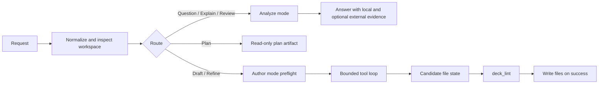

# deck ask

`deck ask`은 현재 워크스페이스를 위한 실험적 워크플로 어시스턴트입니다. 질문에 답하고, 기존 워크플로 파일을 설명하거나 검토하며, 새 워크플로 YAML을 작성하고, 요청이 명백히 작성 작업일 때는 기존 워크플로를 다듬습니다.

`ask`은 표준 `deck` 바이너리에 함께 포함되어 있습니다.

kubeadm 워크플로를 작성할 때는 토폴로지를 명시하는 방식이 현재 가장 안정적으로 작동합니다. 예를 들어 `single-node`처럼 지정합니다. 두루뭉술한 `cluster` 표현은 추가 확인 질문을 부르기 쉽습니다.

## `deck ask`이 하는 일

`deck ask`은 요청마다 의도에 따라 경로를 나눕니다.

- `question`: 워크플로에 관한 직접적인 질문에 답합니다
- `explain`: 기존 파일이나 워크플로의 동작을 설명합니다
- `review`: 현재 워크스페이스를 검토하고 실질적인 문제를 짚어 냅니다
- `draft`: 새 워크플로나 시나리오 골격을 만듭니다
- `refine`: 기존 워크플로를 수정합니다

작성 의도를 명시하려면 `--create`나 `--edit`을 사용합니다. 아직 워크플로 파일을 쓰지 않고 저장된 플랜 아티팩트만 얻고 싶다면 `deck ask plan`을 사용합니다.

명령 수준의 문법과 하위 명령은 [CLI Reference](cli.md)를 참고합니다.

내부 파이프라인을 다루는 기여자라면 [Ask Agent Runtime](https://github.com/Airgap-Castaways/deck/blob/main/docs/contributing/ask-agent-runtime.md)을 참고합니다. 런타임이 지금의 형태로 자리 잡은 배경은 [Ask History](https://github.com/Airgap-Castaways/deck/blob/main/docs/contributing/ask-history.md)에서 확인할 수 있습니다.

## 동작 방식

`deck ask`은 이제 두 갈래로 분리된 런타임을 사용합니다. 답변 중심 요청에는 읽기 전용 분석을, 생성·편집 작업에는 범위가 제한된 작성 런타임을 사용합니다.



### 1단계: 요청 정규화 및 라우팅

`deck ask`은 먼저 프롬프트, 현재 워크스페이스, 저장된 ask 설정, 선택적 `--from` 콘텐츠, 그리고 `--review`·`--create`·`--edit` 같은 라우팅 플래그를 불러옵니다.

플래그로 경로가 강제되지 않으면, `deck ask`은 요청을 일반 ask 라우트 중 하나로 분류합니다. 안전하게 분류하기에 요청이 너무 모호하면, 섣불리 추측하지 않고 명확한 설명을 요청합니다.

### 2단계: 분석 모드는 읽기 전용을 유지

`question`, `explain`, `review`, `plan`은 읽기 전용 경로를 유지합니다.

이 경로에서 사용할 수 있는 자료는 다음과 같습니다.

- 현재 리포지토리의 워크스페이스 파일
- 워크플로 규칙과 동작에 관한 deck 자체의 로컬 사실
- 요청이 최신 업스트림 사실을 필요로 할 때의 선택적 외부 증거

이 경로는 답변이나 저장된 플랜 아티팩트를 반환할 뿐, 워크플로 파일은 쓰지 않습니다.

### 3단계: 작성 모드는 도구를 통해 실제 파일을 다룸

요청이 `draft`나 `refine`로 결정되면, `deck ask`은 범위가 제한된 작성 런타임으로 전환합니다.

모델이 무엇이든 편집하기 전에, 코드가 다음을 결정하는 프리플라이트 작업을 수행합니다.

- 어떤 파일이 범위에 들어가는지
- 정말로 누락된 세부 정보 때문에 요청이 막혀 있는지
- refine이 앵커 파일 외에 동반 파일까지 손댈 수 있는지
- 빈 워크스페이스에 초기 스캐폴드 상태가 필요한지

그런 다음 모델은 실제 워크스페이스에서 다음의 단출한 도구 모음으로 작업합니다.

- `glob`
- `read`
- `file_write`
- `file_edit`
- `init`
- `validate`
- 외부 증거가 허용되고 필요할 때의 `mcp_web_search`

`file_write`과 `file_edit`은 워크플로 파일을 디스크에 곧바로 쓰지 않습니다. 먼저 세션이 소유한 후보 상태를 갱신하고, 세션이 성공적으로 끝난 뒤에야 `deck ask`이 파일을 씁니다. 빈 워크스페이스에서는 작성 런타임이 내부 `init` 도구를 먼저 호출할 수 있습니다. 이 도구는 생성할 워크플로 파일에 필요한 최소한의 디렉터리, ignore 파일, 출력용 `.keep` 파일만 준비합니다. 전체 `deck init`을 실행하거나 시작용 워크플로 템플릿을 만들지는 않습니다.

### 4단계: lint가 최종 쓰기를 통제

작성 모드는 다음 중 하나에 이를 때까지 반복합니다.

- `deck_lint`이 성공하고 모델이 작업을 마침
- `deck ask`이 진짜 차단 요인을 감지하고 명확한 설명을 요청함
- 세션이 턴 예산에 도달함

이렇게 해서 검증과 범위 강제를 코드 수준에 둡니다. 현재 후보 상태가 lint를 통과하기 전까지는 완료 신호를 받아들이지 않습니다.

세션 트랜스크립트와 도구 결과는 `./.deck/ask/` 아래에 저장되며, 디버깅용 `./.deck/ask/last-agent-session.json`도 함께 남습니다.

### 5단계: 외부 증거는 선택적이며 범위가 제한됨

`deck ask`은 여전히 deck 자체의 워크플로 진실과 업스트림 제품 사실을 구분합니다.

- 워크플로 경로, 스키마, 타입이 지정된 스텝, 검증 동작은 로컬 deck 사실이 권위를 가집니다
- 외부 증거는 설치 절차, 호환성, 버전별 안내, 문제 해결처럼 최신 업스트림 사실을 위한 것입니다

분석 모드에서는 정책이 요구할 때 외부 증거를 미리 수집할 수 있습니다. 작성 모드에서는 매 실행마다 미리 가져오는 대신, 외부 조회를 루프 내 선택적 도구로 노출합니다.

### 6단계: `plan`은 읽기 전용을 유지

`deck ask plan`은 일반 요청과 파이프라인 앞부분을 공유합니다. 즉, 프롬프트를 이해하고, 워크스페이스를 살펴보며, 차단 요인이나 확인이 필요한 사항을 드러냅니다.

차이는 `plan`이 워크플로 파일을 쓰는 대신 `./.deck/plan/` 아래에 저장된 구현 아티팩트에서 멈춘다는 점입니다. 크거나 모호한 요청에는 이 경로가 더 안전합니다.

## 제공자와 모델 설정

기본 설정은 한 번만 저장하면 됩니다.

```bash
deck ask config set \
  --provider openai \
  --model gpt-5.4 \
  --endpoint https://api.openai.com/v1 \
  --api-key "$DECK_ASK_API_KEY"
```

적용 중인 설정을 확인합니다.

```bash
deck ask config show
```

저장된 설정을 지웁니다.

```bash
deck ask config unset
```

현재 지원하는 제공자는 다음과 같습니다.

- `openai`
- `openrouter`
- `gemini`

`provider`, `model`, `endpoint`은 전역으로 저장하는 대신 명령마다 재정의할 수도 있습니다.

## OpenAI OAuth 세션 명령

OpenAI 제공자를 사용한다면, `deck`은 정적 API 키 설정과 함께 로컬에 저장된 OAuth 세션도 지원합니다.

저장된 세션이 있는지 확인합니다.

```bash
deck ask status --provider openai
```

브라우저 흐름으로 로그인을 시작합니다.

```bash
deck ask login --provider openai
```

헤드리스 환경에서는 디바이스 로그인을 사용하거나 토큰을 직접 가져올 수 있습니다.

```bash
deck ask login --provider openai --headless
printf '%s' "$OPENAI_OAUTH_TOKEN" | deck ask login --provider openai --stdin-token
```

저장된 세션을 제거합니다.

```bash
deck ask logout --provider openai
```

OAuth 세션 명령은 제공자별 보조 도구입니다. 제공자, 모델, 엔드포인트, 증거 설정을 선택하는 `ask config set`을 대체하지는 않습니다.

## 외부 증거 제공자 설정

적용 중인 제공자 구성을 확인합니다.

```bash
deck ask config show
```

제공자 상태와 기능 지원 여부를 점검합니다.

```bash
deck ask config health
```

내장 제공자를 사용하는 설정 예시입니다.

```json
{
  "ask": {
    "provider": "openai",
    "model": "gpt-5.4",
    "mcp": {
      "enabled": true,
      "servers": [
        { "name": "context7" },
        { "name": "web-search" }
      ]
    }
  }
}
```

전송 방식을 선택적으로 재정의하는 예시입니다.

```json
{
  "ask": {
    "mcp": {
      "enabled": true,
      "servers": [
        {
          "name": "context7",
          "command": "npx",
          "args": ["-y", "@upstash/context7-mcp@latest"]
        }
      ]
    }
  }
}
```

## 자주 쓰는 사용 패턴

직접 질문하기:

```bash
deck ask "what does workflows/scenarios/apply.yaml do?"
```

기존 워크플로 파일 설명하기:

```bash
deck ask "explain what workflows/scenarios/apply.yaml does"
```

현재 워크스페이스 검토하기:

```bash
deck ask --review
```

새 워크플로 초안 작성하기:

```bash
deck ask --create "create an air-gapped rhel9 single-node kubeadm workflow"
```

기존 워크플로 다듬기:

```bash
deck ask --edit "add containerd configuration to the apply workflow"
```

요청 파일 사용하기:

```bash
deck ask --from ./request.md
deck ask --create --from ./request.md
```

`deck ask`이 확인 요청으로 답하면, 누락된 세부 정보를 채워 넣거나 명시적인 라우트 플래그를 사용합니다.

```bash
deck ask --create "create a two-node offline kubeadm workflow"
deck ask --edit "refactor workflows/scenarios/apply.yaml to use workflows/vars.yaml"
deck ask --review "review workflows/scenarios/apply.yaml for offline issues"
```

## 플랜 모드

한 번에 좋은 편집을 끌어내기에 요청이 너무 크거나 모호할 때는 `deck ask plan`을 사용합니다.

```bash
deck ask plan "air-gapped rhel9 kubeadm cluster with prepare/apply split"
```

플랜 아티팩트는 기본적으로 `./.deck/plan/` 아래에 기록됩니다. 흔한 후속 흐름은 다음과 같습니다.

```bash
deck ask plan --from .deck/plan/latest.json --answer topology.kind=multi-node
deck ask plan --from .deck/plan/latest.json --answer topology.roleModel=1cp-2workers
deck ask --from .deck/plan/latest.md "implement this plan"
```

요청에 여전히 차단 요인이나 해소되지 않은 확인 사항이 남아 있으면, `deck ask`은 빈약한 워크플로 출력을 쓰는 대신 계획 단계에서 멈출 수 있습니다. 차단 요인이 되는 확인 사항이 풀릴 때까지 `--answer key=value`로 저장된 플랜 아티팩트에서 작업을 이어 갑니다.

## 워크스페이스와 파일

- `deck ask`은 기본적으로 현재 워크스페이스를 대상으로 동작합니다.
- ask 세션 상태는 `./.deck/ask/` 아래에 저장됩니다.
- 저장된 ask 설정 기본값은 `~/.config/deck/config.json`의 최상위 `ask` 객체로 보관됩니다.
- 생성된 워크플로 파일은 `workflows/prepare.yaml`, `workflows/scenarios/`, `workflows/components/`, `workflows/vars.yaml` 같은 일반적인 deck 워크플로 트리 안에 자리합니다.

## 진단 및 문제 해결 {#diagnostics-and-troubleshooting}

전역 `--v=<n>`은 stderr로 출력되는 터미널 진단을 제어합니다.

- `--v=0`: ask 진단 없음
- `--v=1`: 라우트, 제공자, 진행 요약을 stderr에 출력
- `--v=2`: 라우트/제공자 요약에 더해 사용자 명령과 MCP 이벤트를 출력
- `--v=3`: 디버그 로그에 더해 분류기와 라우트 프롬프트 텍스트를 출력

라우트 선택, 확인 동작, 외부 증거 설정을 들여다봐야 할 때는 추적 수준 진단을 사용합니다.

```bash
deck ask --v=3 "review this workspace"
```

외부 증거 설정에서는 `deck ask config health`이 다음을 구분하는 가장 빠른 방법입니다.

- 전송 시작 실패
- MCP 초기화 실패
- 도구 목록 불일치
- 필수 제공자 기능 누락

최신성에 민감한 요청이 필요한 외부 증거를 구하지 못해 실패하면, 먼저 제공자 설정을 고친 뒤 요청을 다시 실행합니다.

## 현재 제약 사항

- `deck ask`은 실험적입니다.
- 작성 라우트는 모델 접근에 의존합니다.
- `explain`과 `review`은 모델 접근이 불가능할 때 제한적인 로컬 폴백만 제공합니다.
- 작성 라우트는 로컬 검증이 생성을 대신할 수 없으므로, 모델 출력을 사용할 수 없으면 빠르게 실패합니다.
- 최신성에 민감한 요청도 필요한 외부 증거를 구하지 못하면 빠르게 실패할 수 있습니다.
- `--max-iterations`은 `draft`와 `refine` 같은 생성 라우트에만 적용됩니다.
