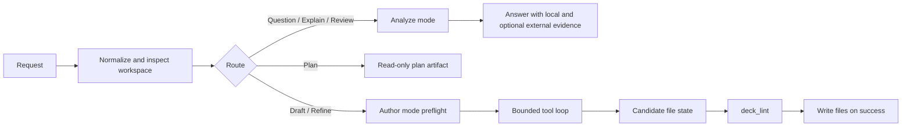

# deck ask

`deck ask`는 현재 워크스페이스를 위한 실험적 워크플로 어시스턴트입니다. 질문에 답하고, 기존 워크플로 파일을 설명하거나 검토하며, 새 워크플로 YAML을 생성하고, 요청이 명확히 작성 작업일 때 기존 워크플로를 다듬을 수 있습니다.

`ask`는 표준 `deck` 바이너리의 일부로 제공됩니다.

kubeadm 작성의 경우, 현재 가장 신뢰할 수 있는 시작 프롬프트는 토폴로지를 명시하는 것입니다. 예를 들어 `single-node`처럼요. 일반적인 `cluster`라는 표현은 명확화 요청을 유발할 가능성이 더 큽니다.

## `deck ask`가 하는 일

`deck ask`는 각 요청을 의도에 따라 라우팅합니다:

- `question`: 직접적인 워크플로 질문에 답합니다
- `explain`: 기존 파일이나 워크플로가 하는 일을 설명합니다
- `review`: 현재 워크스페이스를 검토하고 실질적인 문제를 짚어줍니다
- `draft`: 새 워크플로 또는 시나리오 형태를 생성합니다
- `refine`: 기존 워크플로를 수정합니다

작성 의도를 명시하고 싶을 때는 `--create` 또는 `--edit`를 사용하세요. 아직 워크플로 파일을 작성하지 않고 저장된 플랜 아티팩트만 원할 때는 `deck ask plan`을 사용하세요.

명령어 수준의 구문과 하위 명령에 대해서는 [CLI Reference](cli.md)를 참고하세요.

내부 파이프라인을 작업하는 기여자는 [Ask Agent Runtime](https://github.com/Airgap-Castaways/deck/blob/main/docs/contributing/ask-agent-runtime.md)을 참고하세요. 런타임이 이렇게 생긴 배경에 대해서는 [Ask History](https://github.com/Airgap-Castaways/deck/blob/main/docs/contributing/ask-history.md)를 참고하세요.

## 동작 방식

`deck ask`는 이제 분할된 런타임을 사용합니다: 답변 지향 요청에는 읽기 전용 분석을, 생성/편집 작업에는 제한된 작성 런타임을 사용합니다.



### 1단계: 요청을 정규화하고 라우팅

`deck ask`는 먼저 프롬프트, 현재 워크스페이스, 저장된 ask 설정, 선택적 `--from` 내용, 그리고 `--review`, `--create`, `--edit` 같은 라우트 플래그를 로드합니다.

플래그로 라우트가 강제되지 않으면, `deck ask`는 요청을 일반 ask 라우트 중 하나로 분류합니다. 안전하게 분류하기에 요청이 너무 모호하면, 추측하는 대신 명확화를 요청합니다.

### 2단계: 분석 모드는 읽기 전용을 유지

`question`, `explain`, `review`, `plan`은 읽기 전용 경로를 유지합니다.

이 경로는 다음을 사용할 수 있습니다:

- 현재 리포의 워크스페이스 파일
- 워크플로 규칙과 동작에 대한 deck 소유의 로컬 사실
- 요청에 최신 업스트림 사실이 필요할 때의 선택적 외부 증거

이 라우트들은 답변 또는 저장된 플랜 아티팩트를 반환합니다. 워크플로 파일을 작성하지는 않습니다.

### 3단계: 작성 모드는 도구를 통해 실제 파일을 다룸

요청이 `draft` 또는 `refine`로 해소되면, `deck ask`는 제한된 작성 런타임으로 전환합니다.

모델이 무언가를 편집하기 전에, 코드가 다음을 결정하기 위해 사전 점검(preflight) 작업을 수행합니다:

- 어떤 파일이 범위에 들어가는지
- 요청이 실제로 누락된 세부 정보 때문에 막혀 있는지
- refine가 앵커 파일에 더해 동반 파일까지 건드려도 되는지
- 비어 있는 워크스페이스에 초기 스캐폴드 상태가 필요한지

그런 다음 모델은 실제 워크스페이스에 대해 작은 도구 집합으로 작업합니다:

- `glob`
- `read`
- `file_write`
- `file_edit`
- `init`
- `validate`
- 외부 증거가 허용되고 필요할 때의 `mcp_web_search`

`file_write`와 `file_edit`는 워크플로 파일을 즉시 디스크에 쓰지 않습니다. 먼저 세션 소유의 후보 상태를 갱신한 뒤, `deck ask`는 세션이 성공적으로 끝난 후에만 파일을 작성합니다. 비어 있는 워크스페이스에서는 작성 런타임이 먼저 내부 `init` 도구를 호출할 수 있습니다. 이 도구는 생성될 워크플로 파일에 필요한 최소한의 디렉터리, ignore 파일, 출력 `.keep` 파일만 준비합니다. 전체 `deck init`을 실행하거나 스타터 워크플로 템플릿을 만들지는 않습니다.

### 4단계: Lint가 최종 쓰기를 통제

작성 모드는 다음 중 하나가 발생할 때까지 반복합니다:

- `deck_lint`가 성공하고 모델이 종료함
- `deck ask`가 진짜 블로커를 감지하여 명확화를 요청함
- 세션이 턴 예산에 도달함

이를 통해 검증과 범위 강제는 코드 안에 유지됩니다. 현재 후보 상태가 lint를 통과하기 전까지는 종료 신호가 거부됩니다.

세션 트랜스크립트와 도구 결과는 `./.deck/ask/` 아래에 저장되며, 디버깅용 `./.deck/ask/last-agent-session.json`도 포함됩니다.

### 5단계: 외부 증거는 선택적이며 제한됨

`deck ask`는 여전히 deck 소유의 워크플로 진실과 업스트림 제품 사실을 구분합니다.

- 로컬 deck 사실은 워크플로 경로, 스키마, 타입이 지정된 스텝, 검증 동작에 대해 권위를 유지합니다
- 외부 증거는 설치 단계, 호환성, 버전별 가이드, 또는 문제 해결 같은 최신 업스트림 사실을 위한 것입니다

분석 모드에서는 정책상 필요할 때 외부 증거를 사전에 수집할 수 있습니다. 작성 모드에서는 외부 조회가 매 실행마다 사전 수집되는 대신, 루프 내 선택적 도구로 노출됩니다.

### 6단계: `plan`은 읽기 전용을 유지

`deck ask plan`은 일반 요청과 파이프라인 앞부분을 공유합니다: 프롬프트를 이해하고, 워크스페이스를 점검하며, 블로커나 명확화 사항을 드러냅니다.

차이점은 `plan`이 워크플로 파일을 작성하는 대신 `./.deck/plan/` 아래의 저장된 구현 아티팩트에서 멈춘다는 것입니다. 이것이 크거나 모호한 요청에 더 안전한 경로입니다.

## 프로바이더와 모델 설정

기본 설정을 한 번 저장하세요:

```bash
deck ask config set \
  --provider openai \
  --model gpt-5.4 \
  --endpoint https://api.openai.com/v1 \
  --api-key "$DECK_ASK_API_KEY"
```

적용 중인 설정 확인:

```bash
deck ask config show
```

저장된 설정 삭제:

```bash
deck ask config unset
```

현재 지원되는 프로바이더는 다음과 같습니다:

- `openai`
- `openrouter`
- `gemini`

전역으로 저장하는 대신 명령마다 `provider`, `model`, `endpoint`를 재정의할 수도 있습니다.

## OpenAI OAuth 세션 명령

OpenAI 프로바이더를 사용하는 경우, `deck`는 정적 API 키 설정과 함께 저장된 로컬 OAuth 세션도 지원합니다.

저장된 세션이 있는지 확인:

```bash
deck ask status --provider openai
```

브라우저 플로우로 로그인 시작:

```bash
deck ask login --provider openai
```

헤드리스 환경에서는 디바이스 로그인을 사용하거나 토큰을 직접 가져올 수 있습니다:

```bash
deck ask login --provider openai --headless
printf '%s' "$OPENAI_OAUTH_TOKEN" | deck ask login --provider openai --stdin-token
```

저장된 세션 제거:

```bash
deck ask logout --provider openai
```

OAuth 세션 명령은 프로바이더 전용 헬퍼입니다. 프로바이더, 모델, 엔드포인트, 증거 설정을 선택하는 `ask config set`을 대체하지 않습니다.

## 외부 증거 프로바이더 설정

적용 중인 프로바이더 구성 확인:

```bash
deck ask config show
```

프로바이더 상태와 기능 지원 확인:

```bash
deck ask config health
```

내장 프로바이더를 사용하는 설정 예시:

```json
{
  "ask": {
    "provider": "openai",
    "model": "gpt-5.4",
    "mcp": {
      "enabled": true,
      "servers": [
        { "name": "context7" },
        { "name": "web-search" }
      ]
    }
  }
}
```

선택적 전송(transport) 재정의 예시:

```json
{
  "ask": {
    "mcp": {
      "enabled": true,
      "servers": [
        {
          "name": "context7",
          "command": "npx",
          "args": ["-y", "@upstash/context7-mcp@latest"]
        }
      ]
    }
  }
}
```

## 일반적인 사용 패턴

직접 질문하기:

```bash
deck ask "what does workflows/scenarios/apply.yaml do?"
```

기존 워크플로 파일 설명하기:

```bash
deck ask "explain what workflows/scenarios/apply.yaml does"
```

현재 워크스페이스 검토하기:

```bash
deck ask --review
```

새 워크플로 초안 작성하기:

```bash
deck ask --create "create an air-gapped rhel9 single-node kubeadm workflow"
```

기존 워크플로 다듬기:

```bash
deck ask --edit "add containerd configuration to the apply workflow"
```

요청 파일 사용하기:

```bash
deck ask --from ./request.md
deck ask --create --from ./request.md
```

`deck ask`가 명확화를 요청하면, 누락된 세부 정보를 추가하거나 명시적인 라우트 플래그를 사용하세요:

```bash
deck ask --create "create a two-node offline kubeadm workflow"
deck ask --edit "refactor workflows/scenarios/apply.yaml to use workflows/vars.yaml"
deck ask --review "review workflows/scenarios/apply.yaml for offline issues"
```

## 플랜 모드

요청이 너무 크거나 모호해서 한 번에 좋은 편집을 하기 어려울 때는 `deck ask plan`을 사용하세요:

```bash
deck ask plan "air-gapped rhel9 kubeadm cluster with prepare/apply split"
```

플랜 아티팩트는 기본적으로 `./.deck/plan/` 아래에 작성됩니다. 흔한 후속 플로우는 다음과 같습니다:

```bash
deck ask plan --from .deck/plan/latest.json --answer topology.kind=multi-node
deck ask plan --from .deck/plan/latest.json --answer topology.roleModel=1cp-2workers
deck ask --from .deck/plan/latest.md "implement this plan"
```

요청에 여전히 블로커나 해소되지 않은 명확화 사항이 있을 때, `deck ask`는 빈약한 워크플로 출력을 작성하는 대신 플랜 단계에서 멈출 수 있습니다. 막고 있는 명확화 사항이 해소될 때까지 `--answer key=value`로 저장된 플랜 아티팩트에서 이어가세요.

## 워크스페이스와 파일

- `deck ask`는 기본적으로 현재 워크스페이스를 대상으로 동작합니다.
- Ask 세션 상태는 `./.deck/ask/` 아래에 있습니다.
- 저장된 ask 설정 기본값은 `~/.config/deck/config.json`의 최상위 `ask` 객체로 있습니다.
- 생성된 워크플로 파일은 `workflows/prepare.yaml`, `workflows/scenarios/`, `workflows/components/`, `workflows/vars.yaml` 같은 일반 deck 워크플로 트리 안에 유지됩니다.

## 진단 및 문제 해결 {#diagnostics-and-troubleshooting}

전역 `--v=<n>`는 stderr의 터미널 진단을 제어합니다:

- `--v=0`: ask 진단 없음
- `--v=1`: stderr에 라우트, 프로바이더, 진행 요약
- `--v=2`: 라우트/프로바이더 요약과 함께 사용자 명령 및 MCP 이벤트
- `--v=3`: 디버그 로그와 함께 분류기 및 라우트 프롬프트 텍스트

라우트 선택, 명확화 동작, 또는 외부 증거 설정을 점검해야 할 때는 트레이스 수준 진단을 사용하세요:

```bash
deck ask --v=3 "review this workspace"
```

외부 증거 설정의 경우, `deck ask config health`가 다음을 구분하는 가장 빠른 방법입니다:

- 전송 시작 실패
- MCP 초기화 실패
- 도구 목록 불일치
- 누락된 필수 프로바이더 기능

최신성에 민감한 요청이 필요한 외부 증거를 사용할 수 없어 실패하면, 먼저 프로바이더 설정을 고친 후 요청을 다시 실행하세요.

## 현재 제한 사항

- `deck ask`는 실험적입니다.
- 작성 라우트는 모델 접근에 의존합니다.
- `explain`과 `review`는 모델 접근이 불가능할 때 로컬 폴백이 제한적입니다.
- 작성 라우트는 모델 출력을 사용할 수 없을 때 빠르게 실패합니다. 로컬 검증이 생성을 대체할 수 없기 때문입니다.
- 최신성에 민감한 요청도 필요한 외부 증거를 사용할 수 없을 때 빠르게 실패할 수 있습니다.
- `--max-iterations`는 `draft`와 `refine` 같은 생성 라우트에만 적용됩니다.
