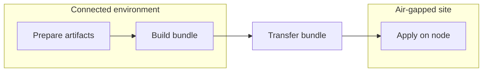
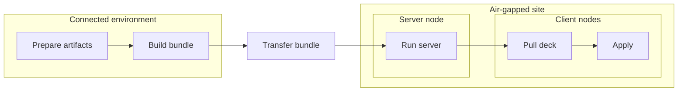

# 아키텍처

이 문서는 `deck`의 아키텍처 구조를 설명합니다.

`deck`은 에어갭(망분리) 환경처럼 운영 제약이 큰 환경을 위한 로컬 우선(local-first) 워크플로 도구입니다. 설계는 단순한 전제에서 출발합니다. 연결된 동안 필요한 것을 모아 두고, 명시적이며 검증 가능한 번들에 담아 경계 너머로 옮긴 뒤, 변경이 필요한 바로 그 머신에서 로컬로 실행한다는 것입니다.

워크플로 필드, CLI 플래그, 번들 레이아웃의 세부 사항은 레퍼런스 문서를 참고하세요. 이 문서는 그 세부 사항 뒤에 자리한 더 큰 구조에 집중합니다.

## 기본 모델

`deck`의 핵심 생애주기는 세 단계로 이루어집니다.

1. 워크플로를 작성하고 검증합니다
2. 오프라인 실행에 필요한 아티팩트를 준비합니다
3. 대상 측에서 로컬로 적용합니다

이 분리가 아키텍처의 중심입니다.

- **준비(Prepare)** 는 연결이 살아 있는 동안 네트워크에 의존하는 입력을 해소합니다.
- **번들(Bundle)** 은 워크플로, 아티팩트, 바이너리를 명시적인 인계 단위로 묶습니다.
- **적용(Apply)** 은 인터넷 접속, SSH, PXE, 상시 동작하는 컨트롤러를 전제하지 않고 호스트 변경을 로컬로 수행합니다.

`apply`를 실행하는 시점에는 워크플로와 그에 필요한 아티팩트가 이미 갖춰져 있어야 합니다.

## 시스템 경계

`deck`은 실무적으로 네 가지 경계를 넘나들며 동작합니다.

- **연결된 환경**: 워크플로를 작성하고, 린트하고, 준비하는 곳
- **전송 경계**: 준비된 콘텐츠를 패키징해 에어갭 안으로 옮기는 지점
- **에어갭 사이트**: 번들이 존재하고, 필요하면 로컬 `deck server`를 선택적으로 운영할 수 있는 곳
- **대상 노드**: `deck apply`가 호스트 변경을 로컬로 수행하는 곳

이 분리는 의도된 것입니다. 연결된 쪽이 외부 의존성을 해소해 사이트 쪽은 그럴 필요가 없도록 만듭니다.

## 수동 우선·로컬 우선 설계

`deck`은 무인 조정(reconciliation)이 아니라 수동 우선 운영을 중심으로 설계되었습니다.

일반적인 운영 그림은 이렇습니다. 운영자가 알려진 워크플로를 준비하고 알려진 번들을 제약된 사이트로 옮긴 뒤 명시적인 로컬 작업을 실행합니다. 시스템은 환경을 끊임없이 수렴시키는 상시 컨트롤러가 아니라, 검토 가능한 워크플로, 명시적인 번들 인계, 노드 로컬 실행을 중심으로 구성됩니다.

그래서 아키텍처는 다음을 강조합니다.

- 검토 가능한 워크플로
- 명시적인 번들 인계
- 노드 로컬 실행
- 필수 컨트롤 플레인 대신 선택적 보조 요소

## 단일 노드 흐름

가장 단순한 `deck` 워크플로는 `prepare -> bundle -> apply`가 전부입니다.

- 연결된 환경에서 운영자는 워크플로가 실행 시점에 필요로 할 아티팩트를 준비합니다.
- 준비된 산출물, 워크플로 파일, 매니페스트, `deck` 바이너리를 하나의 번들로 패키징합니다.
- 번들은 오프라인 경계를 넘어 대상 사이트로 전송됩니다.
- 대상 노드에서 번들을 풀고 `deck apply`를 로컬로 실행합니다.
- 검증, 린트, 검토는 보통 이 흐름에 앞서 이루어지지만, 핵심 경로인 `prepare -> bundle -> apply`를 선명하게 유지하기 위해 다이어그램에서는 생략했습니다.

이것이 나머지 아키텍처가 그 위에 세워지는 기본 경로입니다. 준비된 번들 하나, 로컬 바이너리 하나, 그리고 타입이 지정된 워크플로를 적용하는 대상 머신 하나입니다.

## 다중 노드 흐름

다중 노드 작업에서도 핵심 형태는 여전히 `prepare -> bundle -> apply`입니다. 차이는 사이트 안의 한 노드가 서버 역할을 맡고, 나머지 노드가 로컬로 실행하기 전에 필요한 것을 그 노드에서 가져온다는 점입니다.

실무적으로 그 서버는 `deck` 바이너리, 워크플로, 준비된 파일을 위한 로컬 웹 서버 또는 파일 서버 역할을 할 수 있고, 준비된 이미지를 위한 pull 전용 컨테이너 레지스트리도 노출할 수 있습니다. 이렇게 하면 전체 모델은 그대로 두면서 사이트 내부의 오프라인 배포를 더 수월하게 만듭니다.

- 연결된 환경에서 운영자는 단일 노드 흐름과 같은 방식으로 아티팩트를 준비하고 번들을 빌드합니다.
- 번들이 사이트로 넘어온 뒤, 한 노드가 서버 역할을 맡아 `deck server`를 실행할 수 있습니다.
- 그 서버는 로컬 웹/파일 서빙 경로와 pull 전용 레지스트리 지원을 통해 에어갭 안에서 `deck` 바이너리, 워크플로 파일, 준비된 파일, 준비된 이미지를 배포할 수 있습니다.
- 클라이언트 노드는 서버에서 필요한 것을 가져온 뒤, 각 노드에서 로컬로 실행합니다.
- 선택적 서버는 사이트 내부의 번들 배포를 더 수월하게 만들지만, 실행 상태와 실행 이력은 여전히 워크플로를 실행하는 노드에 속합니다.

이 경우에도 `deck`은 중앙 조정 컨트롤러 역할을 하지 않습니다. 서버는 사이트 로컬 배포를 돕는 보조 요소입니다. 에어갭 안에서 번들 콘텐츠를 서빙할 뿐, 노드 실행을 대신 떠맡지는 않습니다. 각 노드는 여전히 로컬로 실행합니다.

## 번들이 인계 단위인 이유

번들은 연결된 쪽과 사이트 사이의 명시적인 계약입니다.

번들은 다음을 담습니다.

- `deck` 바이너리
- 워크플로 파일
- 패키지, 이미지, 파일 같은 준비된 산출물
- 무결성 검사에 사용하는 매니페스트

각 요소는 저마다 이유가 있어 들어갑니다. 바이너리는 러너를, 워크플로는 의도를, 준비된 산출물은 오프라인 입력을, 매니페스트는 전송된 내용에 대한 무결성 계약을 제공합니다.

번들을 인계 단위로 삼으면 암묵적인 런타임 의존성을 피할 수 있습니다. 사이트에 필요한 것이라면 번들에 들어 있거나 로컬 환경이 의도적으로 제공하는 것이어야 합니다.

## 시나리오 중심 워크스페이스

워크스페이스는 자유도가 매우 높은 워크플로 프래그먼트 그래프에서 시나리오 진입점 쪽으로 점차 옮겨져 왔습니다.

실무적으로 운영자를 마주하는 진입점은 실제 작업을 서술하는 시나리오 형태의 워크플로일 것으로 기대됩니다. 더 하위의 컴포넌트도 여전히 존재하지만, 이는 주요한 사용자 대면 추상화가 아니라 그것을 뒷받침하는 구성 블록입니다.

이렇게 하면 핵심 경로를 찾기 쉬워지고, 예제, 검증, 번들 인덱싱, 서버 목록이 같은 작업 단위를 중심으로 정렬됩니다.

## 타입이 지정된 워크플로가 중심

`deck`은 셸에 치우친 절차보다 타입이 지정된 스텝을 선호합니다. 이는 문서화상의 선호가 아니라 아키텍처적 선택입니다.

타입이 지정된 스텝은 워크플로를 검토하고, 검증하고, 발전시키기 쉽게 만듭니다. 또한 구현이 파일시스템 접근, 명령 실행, 런타임 출력, 스키마 계약에 대해 더 명확한 경계를 유지하도록 해 줍니다.

`Command`는 탈출구로 여전히 쓸 수 있지만, 작성 모델을 지배하도록 의도된 것은 아닙니다.

이 설계에는 사용자 혼란을 줄이려는 이유도 있습니다. `deck`은 같은 동작을 표현하는 여러 겹치는 방식 대신, 흔한 운영 작업에 하나의 명확한 타입 형태를 부여하려 합니다. 목표는 모든 경계 사례를 즉시 모델링하는 것이 아닙니다. 운영자가 대개 어떤 스텝 종류를 골라야 하는지, 그리고 그것이 어떤 동작을 뜻하는지 예측할 수 있을 만큼 핵심 경로를 단순하게 유지하는 것이 목표입니다.

## 그룹 기반 스텝 탐색

공개된 타입 스텝 문서는 계열(family)의 평면적 목록이 아니라 작업 중심 그룹을 중심으로 구성됩니다.

`Artifact Staging`, `Package Management`, `Runtime and Services`, `Kubernetes Lifecycle` 같은 그룹은 운영자가 내부 스키마 분류가 아니라 자신이 수행하려는 작업에서 출발하도록 돕습니다.

내부적으로 `deck`은 여전히 등록과 코드 생성을 위한 계열 분류를 유지합니다. 이 분리는 의도된 것입니다.

- `kind`는 구체적인 워크플로 스텝의 정체성입니다
- `group`은 공개 문서/탐색 계층입니다
- `family`는 내부 스키마/코드 생성 그룹화 계층입니다

어떤 기능이 기존 계열에 깔끔하게 들어맞는다면, 관련 없는 새 스텝 종류를 만들기보다 그 계열을 확장하는 편이 여전히 대체로 낫습니다. 다만 공개 문서는 계열 구조를 스텝 발견의 주된 경로로 노출하기보다, 계속 그룹을 통해 운영자를 안내해야 합니다.

## 명령 표면 설계

CLI도 같은 단순화 목표를 따릅니다.

`deck`은 명령 표면을 소수의 생애주기 단계를 중심으로 유지하려 합니다.

- 워크플로 작성 및 검증
- 아티팩트와 번들 입력 준비
- 번들 빌드 및 검증
- 대상 노드에서 로컬 실행
- 사이트 로컬 번들 배포 보조 요소의 선택적 노출

여러 명령이 조금씩 다른 전제로 같은 문제를 푸는 것처럼 보이는 도구 형태를 피하려는 의도입니다. 명령 모델이 작을수록 기본 경로가 선명해지고, 도움말 텍스트, 예제, 문서가 서로 정렬된 상태를 유지합니다.

## 사용성 전략으로서의 단순함

`deck`은 단순함을 구현상의 선호가 아니라 사용성 기능으로 다룹니다.

에어갭 운영에서는 대개 구성 가능성보다 예측 가능성이 더 중요합니다. 그래서 프로젝트는 운영자가 한 번에 머릿속에 담아야 하는 주요 개념의 수를 좁히려 합니다.

이는 여러 곳에서 드러납니다.

- **표준 스캐폴드 형태**: `deck init`은 동등하게 유효한 여러 시작 구조 대신 고정된 프로젝트 레이아웃을 만듭니다
- **변수 정의 경로 축소**: 변수 정의는 `vars.yaml` 같은 중앙 파일 쪽으로 유도됩니다
- **제한된 오버라이드 표면**: 우선순위 규칙을 좁게 유지해 운영자가 최종 값이 어디에서 왔는지 알 수 있게 합니다
- **제한된 컴포넌트 결합**: 컴포넌트가 임의의 교차 임포트와 변수 전달을 갖춘 자유 형식 의존성 그래프로 번지지 않도록 합니다
- **하나의 분명한 핵심 경로**: 흔한 경우에는 작성, 준비, 번들링, 적용에 권장되는 구조가 하나여야 합니다

이는 의도된 절충입니다. 더 작은 사고 모델, 더 명확한 문서, 그리고 운영자가 여러 유효한 형태 중 무엇을 골라야 할지 물어야 하는 상황을 줄이는 대가로 일부 유연성을 포기합니다.

## 선언적 준비 모델

`prepare`는 별도의 임시 다운로드 스크립트 계층이 아니라 워크플로 모델의 일부로 다루어집니다.

아티팩트 수집은 타입이 지정된 워크플로 스텝을 통해 선언적으로 서술되고, 검증·스키마 생성·문서화를 지원하는 동일한 범용 워크플로 기구를 통해 해소될 것으로 기대됩니다. 이렇게 하면 연결된 쪽의 준비 작업이 별도의 절차적 도구 체인으로 새어 나가지 않고 시스템의 나머지와 정렬된 상태를 유지합니다.

대상 쪽에서 무슨 일이 일어날지 설명하는 그 워크플로 트리가, 에어갭을 넘기 전에 무엇을 모아야 하는지도 함께 설명해야 합니다.

## 스키마와 문서 파이프라인

`deck`은 워크플로와 스텝 구조에 대해 Go 모델 정의를 일차적인 진실의 원천으로 다룹니다.

프로젝트는 그 타입 모델로부터 다른 두 계층을 파생합니다.

- 검증과 도구를 위한 기계 판독 계약인 **JSON Schema**
- 사람이 읽는 문서 계층인 **Markdown 레퍼런스 페이지**

이는 같은 형태를 서로 독립적으로 유지하는 세 가지 설명이 아니라 의도된 파이프라인입니다. 타입 스텝이 바뀌면, 먼저 Go 모델을 수정하고, 스키마를 재생성한 뒤, 그 계약과 메타데이터로부터 사용자 대면 문서를 재생성하는 방향이 권장됩니다.

예제와 필드 설명을 유용하게 유지하기 위해 일부 문서 메타데이터가 그 위에 얹히지만, 구조적 계약은 여전히 타입 Go 모델에서 스키마로, 다시 문서로 흘러야 합니다.

## ask 작성 아키텍처

`deck ask`는 제한된 도구 루프를 통해 실제 워크스페이스 파일을 다루는 AI 지원 작성 보조 도구입니다. 이는 시스템의 나머지와 같은 진실의 원천 방향을 따릅니다. 프롬프트를 위해 정본 사실을 투영할 수는 있지만, 스텝 유효성, 필드 열거값, 워크스페이스 경로 규칙의 두 번째 사본을 소유하지는 않습니다. 환경에 LLM 프로바이더가 구성되어 있어야 합니다. 사용법과 구성은 [deck ask 사용하기](../ask.md)를 참고하세요.

## 사이트 로컬 보조 요소 모델

사이트가 에어갭 안에서 공유되는 로컬 소스를 필요로 할 때, `deck server`는 준비된 번들 콘텐츠를 노출하고 무엇을 서빙하는지 감사할 수 있습니다. 이 보조 요소는 핵심 로컬 실행 경로에 대해 부차적인 위치에 머뭅니다.

## 안전성과 신뢰 경계

원칙은 단순합니다. 기능 코드는 의도를 서술하고, 민감한 작업은 감사하기 쉬운 작은 헬퍼 계층에 국소화합니다.

중요한 신뢰 경계는 다음과 같습니다.

- **파일시스템 경로 해석**: 루팅된 경로 헬퍼가 번들, 사이트, 상태 루트 안에서 경로가 어떻게 해석되는지 제약합니다
- **호스트 경로 변경**: 호스트 지향 쓰기는 범용 경로 처리에 섞이지 않고 명시적으로 유지됩니다
- **파일 모드 정책**: 흔한 권한 패턴은 곳곳에 하드코딩되는 대신 중앙에 모입니다
- **명령 실행**: 실행 헬퍼가 워크플로 주도 명령을 더 넓은 시스템 수준 기능과 분리합니다
- **HTTP 응답과 템플릿 렌더링**: 서버 출력은 작은 응답 및 템플릿 헬퍼에 국소화됩니다

이렇게 하면 기능 코드에서 광범위한 보안 억제(suppression)의 필요가 줄고, 위험한 동작을 추론하기 쉬워집니다.

## 호환성과 레거시 제거

`deck`은 아직 릴리스되지 않았으므로, 프로젝트는 현재 폐기된 모든 설계에 대한 레거시 호환 계층을 짊어지기보다 더 작은 정본 모델로 수렴하는 편을 선호합니다.

즉, 전환용 래퍼, 중복된 명령 표면, 레거시 스텝 종류, 임시 호환 심(shim)은 선호되는 형태가 분명해지면 제거될 것으로 기대됩니다. 무기한 지원해야 할 역사적 계층을 쌓기보다, 릴리스 전에 아키텍처를 이해할 수 있게 유지하는 것이 목표입니다.

같은 이유로, v1.0.0 이전 릴리스는 의도된 모델로 수렴하는 가장 명확한 방법일 때 워크플로 스키마, CLI 계약, 번들 구조, 그 밖의 공개된 계약에 대해 호환성을 깨는 변경을 할 수 있습니다.

릴리스 이후에는 호환성 태도가 달라질 것으로 기대됩니다. 그 단계에서는 공개된 계약을 `apiVersion` 같은 명시적 버전 경계를 통해 안정화해야 하며, 이전의 모든 내부 구조를 암묵적으로 지원하는 대신 문서화된 그 경계에서 호환성을 관리합니다.

다시 말해, 호환성은 워크플로 스키마, 번들 계약, 공개 API 같은 명확한 경계에 머물러야 합니다. 내부 패키지 레이아웃과 전환기의 구현 세부는 주된 안정성 대상이 아닙니다.

## 실패 영역

아키텍처는 실패를 그것을 일으킨 단계에 국소화하려 합니다.

- **린트 또는 스키마 실패**는 준비나 실행 이전에 워크플로를 멈춥니다
- **준비 실패**는 연결된 쪽이 완전한 오프라인 인계물을 만들어내지 못했다는 뜻입니다
- **번들 검증 실패**는 전송된 콘텐츠를 있는 그대로 신뢰할 수 없다는 뜻입니다
- **적용 실패**는 연결된 쪽의 아티팩트 파이프라인이 아니라 대상 노드 실행 경로에 영향을 줍니다
- **서버 실패**는 핵심 로컬 적용 모델이 아니라 선택적 사이트 로컬 보조 요소의 동작에 영향을 줍니다

이렇게 하면 실제 운영 중에 시스템을 복구하고 추론하기 쉬워집니다.

## `deck`이 아닌 것

`deck`은 의도적으로 다음이 되려 하지 않습니다.

- 범용 클라우드 프로비저닝 프레임워크
- 상시 동작하는 조정 컨트롤러
- SSH 우선 오케스트레이션 도구

`deck`은 넓은 플랫폼 커버리지보다 단절된 실행, 명시적 인계, 운영자의 명료함이 더 중요한 좁은 부류의 운영 문제를 위한 구조화된 워크플로 러너입니다.

## 시스템 확장하기

새로운 기능은 같은 형태를 따라야 합니다.

- `Command` 사용을 늘리기보다 타입이 지정된 스텝을 추가하는 편을 선호합니다
- 새로운 최상위 스텝 종류를 도입하기보다 기존 명사 계열을 확장하는 편을 선호합니다
- 런타임 부작용은 집중된 헬퍼 경계 안에 유지합니다
- 준비 쪽의 네트워크 작업은 적용 쪽의 호스트 변경 경로에서 분리해 둡니다
- 추가되는 유연성이 운영자가 감당할 복잡성만큼 분명히 가치 있지 않다면 오버라이드와 조합 규칙을 확장하지 않습니다
- 워크플로와 스키마 변경은 함께 문서화합니다
- 선택적 서버 기능이 확장되더라도 기본 경로는 로컬 우선으로 유지합니다

## 관련 레퍼런스

- [왜 deck인가?](why-deck.md)
- [deck 생애주기](lifecycle.md)
- [워크플로 모델](../workflow-model.md)
- [번들 레이아웃](../bundle-layout.md)
- [CLI 레퍼런스](../cli.md)
- [내부 구조 (기여자 레퍼런스)](https://github.com/Airgap-Castaways/deck/blob/main/docs/contributing/internals.md)
