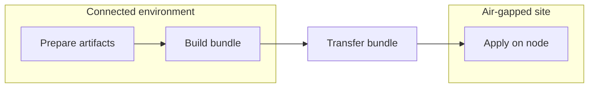
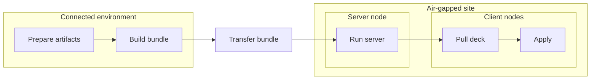

# 아키텍처

이 문서는 `deck`의 아키텍처 형태를 설명합니다.

`deck`는 에어갭(망분리) 및 운영 제약이 있는 환경을 위한 로컬 우선 워크플로 도구입니다. 설계는 단순한 가정에서 출발합니다. 연결된 상태에서 필요한 것을 수집하고, 명시적이고 검증 가능한 번들로 경계를 넘어 운반하며, 변경이 필요한 머신에서 로컬로 실행한다는 것입니다.

워크플로 필드, CLI 플래그, 번들 레이아웃 세부 사항은 레퍼런스 문서를 참고하세요. 이 문서는 그러한 세부 사항 뒤에 있는 더 큰 구조에 초점을 맞춥니다.

## 기본 모델

핵심 `deck` 라이프사이클은 세 단계로 이루어집니다.

1. 워크플로를 작성하고 검증한다
2. 오프라인으로 실행하는 데 필요한 아티팩트를 준비한다
3. 타깃 측에서 로컬로 적용한다

이 분리가 아키텍처의 중심입니다.

- **준비**는 연결성이 존재하는 동안 네트워크 의존 입력을 해석합니다.
- **번들**은 워크플로, 아티팩트, 바이너리를 명시적인 핸드오프 단위로 만듭니다.
- **적용**은 인터넷 접근, SSH, PXE, 또는 장기 실행 컨트롤러를 가정하지 않고 로컬에서 호스트 변경을 수행합니다.

`apply`가 실행될 시점에는 워크플로와 그것이 필요로 하는 아티팩트가 이미 존재해야 합니다.

## 시스템 경계

`deck`는 네 가지 실제 경계를 넘나들며 동작합니다.

- **연결된 환경**: 워크플로를 작성하고, 린트하고, 준비하는 곳
- **전송 경계**: 준비된 콘텐츠를 패키징하여 에어갭 안으로 옮기는 곳
- **에어갭(망분리) 사이트**: 번들이 존재하며 선택적으로 로컬 `deck server`가 실행될 수 있는 곳
- **타깃 노드**: `deck apply`가 로컬로 호스트 변형을 수행하는 곳

이 분리는 의도적입니다. 연결된 측이 외부 의존성을 해석합니다. 사이트 측은 그럴 필요가 없어야 합니다.

## 설계상 수동 우선 및 로컬 우선

`deck`는 무인 조정(reconciliation)이 아니라 수동 우선 운영을 중심으로 설계되었습니다.

일반적인 운영 모습은, 운영자가 알려진 워크플로를 준비하고, 알려진 번들을 제약된 사이트로 운반한 뒤, 명시적인 로컬 작업을 실행하는 것입니다. 이 시스템은 환경을 지속적으로 수렴시키는 상시 가동 컨트롤러가 아니라, 검토 가능한 워크플로, 명시적인 번들 핸드오프, 노드 로컬 실행을 중심으로 구성됩니다.

그래서 이 아키텍처는 다음을 강조합니다.

- 검토 가능한 워크플로
- 명시적인 번들 핸드오프
- 노드 로컬 실행
- 필수 컨트롤 플레인 대신 선택적 헬퍼

## 단일 노드 흐름

가장 단순한 `deck` 워크플로는 그저 `prepare -> bundle -> apply`입니다.

- 연결된 환경에서 운영자는 워크플로가 실행 시점에 필요로 할 아티팩트를 준비합니다.
- 준비된 산출물, 워크플로 파일, 매니페스트, `deck` 바이너리가 하나의 번들로 패키징됩니다.
- 번들은 오프라인 경계를 넘어 타깃 사이트로 전송됩니다.
- 타깃 노드에서 번들이 풀리고 `deck apply`가 로컬로 실행됩니다.
- 검증, 린트, 검토는 보통 이 흐름 이전에 이루어지지만, 핵심 `prepare -> bundle -> apply` 경로를 명확히 유지하기 위해 다이어그램에서는 생략했습니다.

이것이 나머지 아키텍처가 그 위에 세워진 기본 경로입니다. 하나의 준비된 번들, 하나의 로컬 바이너리, 그리고 타입이 지정된 워크플로를 적용하는 하나의 타깃 머신입니다.

## 다중 노드 흐름

다중 노드 작업에서도 핵심 형태는 여전히 `prepare -> bundle -> apply`입니다. 차이점은 사이트 내 한 노드가 서버 역할을 수행할 수 있고, 다른 노드들은 로컬 실행 전에 필요한 것을 그 노드에서 가져온다는 점입니다.

실제로 그 서버는 `deck` 바이너리, 워크플로, 준비된 파일을 위한 로컬 웹 또는 파일 서버 역할을 할 수 있으며, 준비된 이미지에 대한 풀 전용 컨테이너 레지스트리를 노출할 수도 있습니다. 이는 전체 모델을 동일하게 유지하면서 사이트 내부의 오프라인 배포를 더 쉽게 만들어 줍니다.

- 연결된 환경에서 운영자는 단일 노드 흐름과 동일한 방식으로 아티팩트를 준비하고 번들을 빌드합니다.
- 번들이 사이트로 넘어온 후, 한 노드가 서버 역할을 맡아 `deck server`를 실행할 수 있습니다.
- 그 서버는 로컬 웹 또는 파일 서빙 경로와 풀 전용 레지스트리 지원을 통해 에어갭 내부에서 `deck` 바이너리, 워크플로 파일, 준비된 파일, 준비된 이미지를 배포할 수 있습니다.
- 클라이언트 노드는 서버에서 필요한 것을 가져온 다음, 각 노드에서 로컬로 실행합니다.
- 선택적 서버는 사이트 내부에서 번들 배포를 더 쉽게 만들 수 있지만, 실행 상태와 실행 이력은 여전히 워크플로를 실행하는 노드에 속합니다.

여기서도 `deck`는 중앙 조정 컨트롤러로 동작하지 않습니다. 서버는 사이트 로컬 배포 헬퍼입니다. 에어갭 내부에서 번들 콘텐츠를 제공하지만, 노드 실행을 인수하지는 않습니다. 각 노드는 여전히 로컬로 실행합니다.

## 번들이 핸드오프 단위인 이유

번들은 연결된 측과 사이트 사이의 명시적인 계약입니다.

번들은 다음을 담습니다.

- `deck` 바이너리
- 워크플로 파일
- 패키지, 이미지, 파일과 같은 준비된 산출물
- 무결성 검사에 사용되는 매니페스트

각 부분은 이유가 있어 존재합니다. 바이너리는 러너를 제공하고, 워크플로는 의도를 제공하며, 준비된 산출물은 오프라인 입력을 제공하고, 매니페스트는 전송된 내용에 대한 무결성 계약을 제공합니다.

핸드오프 단위로 번들을 사용하면 암묵적인 런타임 의존성을 피할 수 있습니다. 사이트에 필요한 것이라면, 번들에 들어 있거나 로컬 환경에서 의도적으로 제공되어야 합니다.

## 시나리오 지향 워크스페이스

워크스페이스는 워크플로 프래그먼트의 매우 개방적인 그래프가 아니라 점진적으로 시나리오 진입점 쪽으로 옮겨져 왔습니다.

실제로 운영자가 마주하는 진입점은 실제 작업을 기술하는 시나리오 형태의 워크플로가 될 것으로 기대됩니다. 더 낮은 수준의 컴포넌트도 여전히 존재하지만, 이는 주된 사용자 대상 추상화라기보다는 보조적인 빌딩 블록입니다.

이는 주 경로를 더 발견하기 쉽게 유지하고, 예제, 검증, 번들 인덱싱, 서버 목록이 동일한 작업 단위를 중심으로 정렬되도록 돕습니다.

## 중심에 있는 타입 지정 워크플로

`deck`는 셸 중심의 절차보다 타입이 지정된 스텝을 선호합니다. 이는 단순한 문서화 차원의 선호가 아니라 아키텍처적 선택입니다.

타입이 지정된 스텝은 워크플로를 검토하고, 검증하고, 발전시키기 더 쉽게 만듭니다. 또한 구현이 파일시스템 접근, 명령 실행, 런타임 산출물, 스키마 계약에 대해 더 명확한 경계를 유지할 수 있게 합니다.

`Command`는 탈출구로 여전히 사용할 수 있지만, 작성 모델을 지배하도록 의도된 것은 아닙니다.

이 설계의 또 다른 이유는 사용자 혼란을 줄이는 것입니다. `deck`는 동일한 동작을 표현하는 여러 겹치는 방식 대신, 공통 운영 작업에 하나의 명확한 타입 형태를 부여하려고 합니다. 목표는 모든 엣지 케이스를 즉시 모델링하는 것이 아닙니다. 목표는, 운영자가 보통 어떤 스텝 종류를 사용해야 하고 그것이 어떤 동작을 함의하는지 예측할 수 있을 만큼 주 경로를 충분히 단순하게 유지하는 것입니다.

## 그룹 기반 스텝 탐색

공개되는 타입 지정 스텝 문서는 패밀리의 평면적 목록이 아니라 작업 지향 그룹을 중심으로 구성됩니다.

`Artifact Staging`, `Package Management`, `Runtime and Services`, `Kubernetes Lifecycle`와 같은 그룹은 운영자가 내부 스키마 분류 체계가 아니라 수행하려는 작업에서 시작하도록 돕습니다.

내부적으로 `deck`는 등록 및 코드 생성을 위해 여전히 패밀리 분류 체계를 유지합니다. 이 분리는 의도적입니다.

- `kind`는 구체적인 워크플로 스텝 정체성입니다
- `group`은 공개 문서/탐색 레이어입니다
- `family`는 내부 스키마/코드젠 그룹화 레이어입니다

어떤 기능이 기존 패밀리에 깔끔하게 맞을 때는, 관련 없는 새 스텝 종류를 만드는 것보다 그 패밀리를 확장하는 것이 보통 여전히 선호됩니다. 다만 공개 문서는 패밀리 구조를 스텝 발견의 주된 방법으로 노출하기보다 그룹을 통해 운영자를 안내해야 합니다.

## 명령 표면 설계

CLI는 동일한 단순화 목표를 따릅니다.

`deck`는 명령 표면을 소수의 라이프사이클 단계를 중심으로 구성하려고 합니다.

- 워크플로를 작성하고 검증한다
- 아티팩트와 번들 입력을 준비한다
- 번들을 빌드하고 검증한다
- 타깃 노드에서 로컬로 실행한다
- 선택적으로 사이트 로컬 번들 배포 헬퍼를 노출한다

그 의도는, 여러 명령이 약간씩 다른 가정으로 동일한 문제를 해결하는 것처럼 보이는 도구 형태를 피하는 것입니다. 더 작은 명령 모델은 기본 경로를 더 명확하게 하고, 도움말 텍스트, 예제, 문서가 정렬되도록 유지합니다.

## 사용성 전략으로서의 단순함

`deck`는 단순함을 단순한 구현상의 선호가 아니라 사용성 기능으로 취급합니다.

에어갭(망분리) 운영에서는 보통 구성 가능성보다 예측 가능성이 더 중요합니다. 따라서 이 프로젝트는 운영자가 한 번에 염두에 두어야 하는 주요 개념의 수를 좁히려고 합니다.

이는 여러 곳에서 드러납니다.

- **표준 스캐폴드 형태**: `deck init`은 똑같이 유효한 여러 시작 구조 대신 고정된 프로젝트 레이아웃을 생성합니다
- **더 적은 변수 정의 경로**: 변수 정의는 `vars.yaml`과 같은 중앙 파일로 권장됩니다
- **제한된 오버라이드 표면**: 우선순위 규칙이 좁게 유지되어 운영자가 최종 값이 어디서 왔는지 알 수 있습니다
- **제한된 컴포넌트 결합**: 컴포넌트는 임의의 교차 임포트와 변수 전달을 가진 자유로운 의존성 그래프가 되도록 의도되지 않았습니다
- **하나의 명백한 주 경로**: 일반적인 경우는 작성, 준비, 번들링, 적용에 대해 하나의 권장 구조를 가져야 합니다

이는 의도적인 트레이드오프입니다. 더 작은 멘탈 모델, 더 명확한 문서, 그리고 운영자가 여러 유효한 형태 중 어느 것을 선택해야 할지 물어야 하는 상황이 줄어드는 대가로 일부 유연성을 포기합니다.

## 선언적 준비 모델

`prepare`는 별도의 임시 다운로드 스크립트 레이어가 아니라 워크플로 모델의 일부로 취급됩니다.

아티팩트 수집은 타입이 지정된 워크플로 스텝을 통해 선언적으로 기술되고, 검증, 스키마 생성, 문서화를 지원하는 동일한 일반 워크플로 기계를 통해 해석될 것으로 기대됩니다. 이는 연결된 측의 준비를 별도의 절차적 도구 체인으로 표류시키지 않고 시스템의 나머지와 정렬되게 유지합니다.

타깃 측에서 무슨 일이 일어날지를 설명하는 동일한 워크플로 트리는, 에어갭을 넘기 전에 무엇을 수집해야 하는지도 설명해야 합니다.

## 스키마 및 문서 파이프라인

`deck`는 Go 모델 정의를 워크플로 및 스텝 구조의 주요 진실 공급원(source of truth)으로 취급합니다.

그 타입 지정 모델로부터 프로젝트는 다른 두 레이어를 도출합니다.

- 검증 및 도구화에 사용되는 머신 판독 가능 계약으로서의 **JSON Schema**
- 사람이 읽을 수 있는 문서 레이어로서의 **Markdown 레퍼런스 페이지**

이는 동일한 형태에 대한 세 개의 독립적으로 유지되는 기술이 아니라 의도적으로 파이프라인입니다. 타입 지정 스텝이 변경되면, 선호되는 방향은 Go 모델을 먼저 업데이트하고, 스키마를 재생성한 다음, 그 계약과 메타데이터로부터 사용자 대상 문서를 재생성하는 것입니다.

일부 문서 메타데이터는 예제와 필드 설명이 유용하게 유지되도록 그 위에 레이어로 얹히지만, 구조적 계약은 여전히 타입 지정 Go 모델에서 스키마로, 그리고 문서로 흘러야 합니다.

## Ask 작성 아키텍처

`deck ask`는 동일한 진실 공급원 방향을 따릅니다. 병렬적인 워크플로 정의 시스템이 되도록 의도되지 않았습니다.

라우트 작성의 경우, 의도된 형태는 먼저 라우트 분류, 모호성이 차단 요소로 남으면 명확화, 그다음 제한된 도구 루프입니다. 실제로 이는 다음을 의미합니다.

- 코드가 요청이 question, explain, review, draft, refine, clarify 중 무엇인지 분류합니다
- 코드가 범위, 타깃 추론, 차단성 명확화를 위한 프리플라이트를 실행합니다
- 모델이 제한된 도구 루프(read, write, edit, validate, schema)를 통해 실제 워크스페이스 파일에서 작동합니다
- 코드가 쓰기 범위, 검증 게이트, 후보 상태 관리를 강제합니다
- 코드가 각 검증 후 스키마 및 역할 위반을 자동 복구합니다
- 코드가 성공적으로 완료된 후에만 수락된 후보 파일을 디스크에 씁니다

중요한 아키텍처 경계는, ask가 프롬프팅과 조립을 위해 정규 사실을 투영(project)할 수는 있지만, 스텝 유효성, 필드 enum, 워크스페이스 경로 규칙의 두 번째 사본을 소유해서는 안 된다는 점입니다.

코드 수준에서 `internal/askcontext`가 그러한 정규 ask 사실의 주된 거처입니다. 명령 메타데이터, 프롬프트/진실 공급원 번들, 스키마 파생 작성 컨텍스트가 거기에 있고, 오케스트레이션은 `internal/askcli`에 남습니다. 이 분리는 ask 동작을 바꾸지 않으면서 메타데이터 표면을 더 발견하기 쉽게 유지합니다.

## 사이트 로컬 헬퍼 모델

사이트가 에어갭 내부에서 공유 로컬 소스를 필요로 할 때, `deck server`는 준비된 번들 콘텐츠를 노출하고 자신이 제공하는 것을 감사할 수 있습니다. 그 헬퍼는 핵심 로컬 실행 경로에 비해 부차적으로 남습니다.

## 안전 및 신뢰 경계

최근 리팩터링은 `deck`를 헬퍼 로컬 신뢰 경계 쪽으로 밀어붙였습니다.

원칙은 단순합니다. 기능 코드는 의도를 기술하고, 민감한 작업은 감사하기 더 쉬운 작은 헬퍼 레이어에 국지화되어 머문다는 것입니다.

중요한 신뢰 경계는 다음을 포함합니다.

- **파일시스템 경로 해석**: 루트 기반 경로 헬퍼가 번들, 사이트, 상태 루트 내에서 경로가 어떻게 해석되는지 제약합니다
- **호스트 경로 변형**: 호스트 지향 쓰기는 일반적인 경로 처리에 섞이지 않고 명시적으로 유지됩니다
- **파일 모드 정책**: 공통 권한 패턴이 여기저기 오픈 코딩되지 않고 중앙화됩니다
- **명령 실행**: 실행 헬퍼가 워크플로 주도 명령을 더 넓은 시스템 수준 기능과 분리합니다
- **HTTP 응답 및 템플릿 렌더링**: 서버 출력이 작은 응답 및 템플릿 헬퍼에 국지화됩니다

이는 기능 코드에서 광범위한 보안 억제(suppression)의 필요성을 줄이고, 위험한 동작을 더 추론하기 쉽게 유지합니다.

## 호환성 및 레거시 제거

`deck`는 아직 릴리스되지 않았으므로, 프로젝트는 현재 폐기된 모든 설계에 대한 레거시 호환성 레이어를 떠안기보다 더 작은 정규 모델로 수렴하는 것을 선호합니다.

이는 전환용 래퍼, 중복된 명령 표면, 레거시 스텝 종류, 임시 호환성 심(shim)이 선호되는 형태가 명확해지면 제거될 것으로 기대됨을 의미합니다. 목표는 무기한 지원해야 할 역사적 레이어를 축적하기보다 릴리스 전에 아키텍처를 이해 가능하게 유지하는 것입니다.

같은 이유로, v1.0.0 이전 릴리스는 의도된 모델로 수렴하는 가장 명확한 방법일 때 워크플로 스키마, CLI 계약, 번들 구조, 기타 공개 계약에 대해 호환성을 깨는 변경을 할 수 있습니다.

릴리스 이후에는 호환성 태도가 바뀔 것으로 기대됩니다. 그 단계에서는 공개 계약이 `apiVersion`과 같은 명시적인 버전 경계를 통해 안정화되어야 하며, 모든 이전 내부 구조에 대한 암묵적 지원이 아니라 그러한 문서화된 가장자리에서 호환성이 관리되어야 합니다.

다시 말해, 호환성은 워크플로 스키마, 번들 계약, 공개 API와 같은 명확한 경계에 존재해야 합니다. 내부 패키지 레이아웃과 전환적 구현 세부 사항은 주된 안정성 대상이 아닙니다.

## 실패 도메인

이 아키텍처는 실패를 그 원인이 된 단계에 국지화하려고 합니다.

- **lint 또는 스키마 실패**는 준비 또는 실행 전에 워크플로를 중단시킵니다
- **prepare 실패**는 연결된 측이 완전한 오프라인 핸드오프를 생성하지 못했음을 의미합니다
- **번들 검증 실패**는 전송된 콘텐츠를 있는 그대로 신뢰할 수 없음을 의미합니다
- **apply 실패**는 연결된 측 아티팩트 파이프라인이 아니라 타깃 노드 실행 경로에 영향을 줍니다
- **server 실패**는 핵심 로컬 적용 모델이 아니라 선택적 사이트 로컬 헬퍼 동작에 영향을 줍니다

이는 실제 운영 중에 시스템을 복구하고 추론하기 더 쉽게 유지합니다.

## `deck`가 아닌 것

`deck`는 의도적으로 다음이 되는 것을 목표로 하지 않습니다.

- 범용 클라우드 프로비저닝 프레임워크
- 장기 실행 조정 컨트롤러
- SSH 우선 오케스트레이션 도구

이것은 단절된 실행, 명시적 핸드오프, 운영자의 명료함이 광범위한 플랫폼 커버리지보다 더 중요한, 더 좁은 부류의 운영 문제를 위한 구조화된 워크플로 러너입니다.

## 코드베이스가 아키텍처에 매핑되는 방식

코드 레이아웃은 대략 이러한 경계를 따릅니다.

- `cmd/`: CLI 진입점
- `internal/config` 및 `internal/workflowexec`: 워크플로 계약, 디코딩, 실행 규칙
- `internal/ask*`: 라우팅된 AI 지원 question, review, planning, draft, refine, compile, repair 흐름
- `internal/prepare` 및 `internal/preparecli`: 연결된 측 준비 로직
- `internal/install`: 타깃 측 호스트 변형 및 적용 동작
- `internal/bundle`: 번들 수집, 임포트, 병합, 검증 로직
- `internal/server`: 선택적 사이트 로컬 HTTP 서버
- `internal/fsutil`, `internal/filemode`, `internal/hostfs`, `internal/executil`: 안전 지향 헬퍼 경계

정확한 패키지 레이아웃은 계속 진화할 수 있지만, 아키텍처 방향은 동일하게 유지됩니다. 얇은 CLI 레이어, 타입 지정 워크플로 경계, 명시적 신뢰 경계, 그리고 최소한의 숨겨진 동작입니다.

## 시스템 확장

새로운 기능은 동일한 형태를 따라야 합니다.

- `Command` 사용을 확장하기보다 타입 지정 스텝을 추가하는 것을 선호한다
- 새로운 최상위 스텝 종류를 도입하기 전에 기존 명사 패밀리를 확장하는 것을 선호한다
- 런타임 부작용을 집중된 헬퍼 경계에 유지한다
- prepare 측 네트워크 작업을 apply 측 호스트 변형 경로 밖에 유지한다
- 추가된 유연성이 추가되는 운영자 복잡성만큼 명백히 가치 있지 않는 한 오버라이드 및 합성 규칙을 확장하지 않는다
- 워크플로와 스키마 변경을 함께 문서화한다
- 선택적 서버 기능이 확장되더라도 기본 경로를 로컬 우선으로 유지한다

## 관련 레퍼런스

- [Why Deck?](why-deck.md)
- [Workflow Model](../workflow-model.md)
- [Bundle Layout](../bundle-layout.md)
- [CLI Reference](../cli.md)
