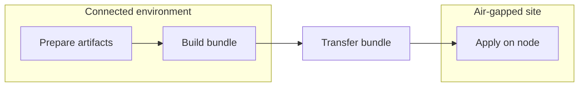
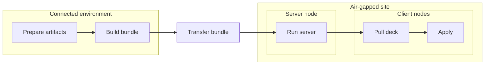

# 아키텍처

이 문서는 `deck`의 아키텍처적 형태를 설명합니다.

`deck`는 에어갭(망분리) 및 운영상 제약이 있는 환경을 위한 로컬 우선(local-first) 워크플로 도구입니다. 설계는 단순한 전제에서 출발합니다: 연결되어 있는 동안 필요한 것을 수집하고, 명시적이고 검증 가능한 번들로 경계를 넘어 운반하며, 변경이 필요한 머신에서 로컬로 실행합니다.

워크플로 필드, CLI 플래그, 번들 레이아웃 세부 사항은 레퍼런스 문서를 참고하세요. 이 문서는 그러한 세부 사항 뒤에 있는 더 큰 구조에 초점을 맞춥니다.

## 기본 모델

핵심 `deck` 라이프사이클은 세 가지 단계로 구성됩니다:

1. 워크플로를 작성하고 검증한다
2. 오프라인으로 실행하는 데 필요한 아티팩트를 준비한다
3. 타깃 측에서 로컬로 적용한다

이 분리가 아키텍처의 중심입니다.

- **준비(Prepare)** 는 연결성이 존재하는 동안 네트워크 의존적인 입력을 해결합니다.
- **번들(Bundle)** 은 워크플로, 아티팩트, 바이너리를 명시적인 인계 단위로 만듭니다.
- **적용(Apply)** 은 인터넷 접근, SSH, PXE, 또는 장기 실행 컨트롤러를 가정하지 않고 호스트 변경을 로컬로 수행합니다.

`apply`가 실행되는 시점에는 워크플로와 그에 필요한 아티팩트가 이미 존재해야 합니다.

## 시스템 경계

`deck`는 네 가지 실질적인 경계에 걸쳐 동작합니다:

- **연결된 환경(Connected environment)**: 워크플로를 작성하고, 린트하고, 준비하는 곳
- **전송 경계(Transfer boundary)**: 준비된 콘텐츠를 패키징하여 에어갭 안으로 옮기는 곳
- **에어갭(망분리) 사이트(Air-gapped site)**: 번들이 존재하며 선택적으로 로컬 `deck server`가 실행될 수 있는 곳
- **타깃 노드(Target node)**: `deck apply`가 호스트 변형을 로컬로 수행하는 곳

이 분리는 의도적입니다. 연결된 측은 외부 의존성을 해결합니다. 사이트 측은 그럴 필요가 없어야 합니다.

## 설계상 매뉴얼 우선, 로컬 우선

`deck`는 무인 조정(unattended reconciliation)이 아니라 매뉴얼 우선(manual-first) 운영을 중심으로 설계되었습니다.

일반적인 운영 그림은, 운영자가 알려진 워크플로를 준비하고, 알려진 번들을 제약된 사이트로 운반하여, 명시적인 로컬 작업을 실행하는 것입니다. 이 시스템은 환경을 지속적으로 수렴시키는 상시 컨트롤러가 아니라, 검토 가능한 워크플로, 명시적인 번들 인계, 노드 로컬 실행을 중심으로 구성됩니다.

그것이 아키텍처가 다음을 강조하는 이유입니다:

- 검토 가능한 워크플로
- 명시적인 번들 인계
- 노드 로컬 실행
- 필수 컨트롤 플레인 대신 선택적 헬퍼

## 단일 노드 흐름

가장 단순한 `deck` 워크플로는 그저 `prepare -> bundle -> apply`입니다.

- 연결된 환경에서, 운영자는 워크플로가 실행 시점에 필요로 할 아티팩트를 준비합니다.
- 준비된 출력물, 워크플로 파일, 매니페스트, `deck` 바이너리가 번들로 패키징됩니다.
- 번들은 오프라인 경계를 넘어 타깃 사이트로 전송됩니다.
- 타깃 노드에서, 번들이 압축 해제되고 `deck apply`가 로컬로 실행됩니다.
- 검증, 린트, 검토는 보통 이 흐름 이전에 일어나지만, 핵심 `prepare -> bundle -> apply` 경로를 명확하게 유지하기 위해 다이어그램에서는 생략되었습니다.

이것이 나머지 아키텍처가 구축되는 기본 경로입니다: 하나의 준비된 번들, 하나의 로컬 바이너리, 그리고 타입이 지정된 워크플로를 적용하는 하나의 타깃 머신.

## 다중 노드 흐름

다중 노드 작업의 경우에도 핵심 형태는 여전히 `prepare -> bundle -> apply`입니다. 차이점은 사이트 내의 한 노드가 서버 역할을 수행할 수 있고, 다른 노드들이 로컬로 실행하기 전에 필요한 것을 그 노드로부터 가져온다는 점입니다.

실제로 그 서버는 `deck` 바이너리, 워크플로, 준비된 파일을 위한 로컬 웹 또는 파일 서버 역할을 할 수 있으며, 준비된 이미지를 위한 풀 전용(pull-only) 컨테이너 레지스트리를 노출할 수도 있습니다. 이는 전체 모델을 동일하게 유지하면서 사이트 내부에서의 오프라인 배포를 더 쉽게 만듭니다.

- 연결된 환경에서, 운영자는 단일 노드 흐름과 동일한 방식으로 아티팩트를 준비하고 번들을 빌드합니다.
- 번들이 사이트 안으로 넘어온 후, 한 노드가 서버 역할을 맡아 `deck server`를 실행할 수 있습니다.
- 그 서버는 로컬 웹/파일 서빙 경로와 풀 전용 레지스트리 지원을 통해 에어갭 내부에서 `deck` 바이너리, 워크플로 파일, 준비된 파일, 준비된 이미지를 배포할 수 있습니다.
- 클라이언트 노드는 서버에서 필요한 것을 가져온 다음, 각 노드에서 로컬로 실행합니다.
- 선택적 서버는 사이트 내부에서 번들 배포를 더 쉽게 만들 수 있지만, 실행 상태와 실행 이력은 여전히 워크플로를 실행하는 노드에 속합니다.

이 경우에도 `deck`는 중앙 조정 컨트롤러로 동작하지 않습니다. 서버는 사이트 로컬 배포 헬퍼입니다: 에어갭 내부에서 번들 콘텐츠를 서빙하지만, 노드 실행을 대신하지는 않습니다. 각 노드는 여전히 로컬로 실행합니다.

## 번들이 인계 단위인 이유

번들은 연결된 측과 사이트 사이의 명시적 계약입니다.

번들은 다음을 담습니다:

- `deck` 바이너리
- 워크플로 파일
- 패키지, 이미지, 파일과 같은 준비된 출력물
- 무결성 검사에 사용되는 매니페스트

각 부분에는 이유가 있습니다: 바이너리는 러너를 제공하고, 워크플로는 의도를 제공하며, 준비된 출력물은 오프라인 입력을 제공하고, 매니페스트는 전송된 것에 대한 무결성 계약을 제공합니다.

번들을 인계 단위로 사용하면 암묵적인 런타임 의존성을 피할 수 있습니다. 사이트가 필요로 한다면, 그것은 번들 안에 있거나 로컬 환경에서 의도적으로 제공되어야 합니다.

## 시나리오 중심 워크스페이스

워크스페이스는 워크플로 프래그먼트로 이루어진 매우 개방적인 그래프보다는 점진적으로 시나리오 진입점 쪽으로 옮겨져 왔습니다.

실제로 운영자가 마주하는 진입점은 실제 작업을 기술하는 시나리오 형태의 워크플로일 것으로 기대됩니다. 더 낮은 수준의 컴포넌트는 여전히 존재하지만, 이는 주된 사용자 대면 추상화라기보다는 보조적인 빌딩 블록입니다.

이는 주 경로를 더 쉽게 발견할 수 있게 하고, 예제, 검증, 번들 인덱싱, 서버 목록이 동일한 작업 단위를 중심으로 정렬되도록 돕습니다.

## 중심에 있는 타입 지정 워크플로

`deck`는 셸 중심 절차보다 타입이 지정된 스텝을 선호합니다. 이는 단순한 문서상의 선호가 아니라 아키텍처적 선택입니다.

타입 지정 스텝은 워크플로를 검토하고, 검증하고, 발전시키기 더 쉽게 만듭니다. 또한 구현이 파일시스템 접근, 명령 실행, 런타임 출력, 스키마 계약 주변에 더 명확한 경계를 유지할 수 있게 합니다.

`Command`는 탈출구(escape hatch)로서 여전히 사용 가능하지만, 작성 모델을 지배하도록 의도된 것은 아닙니다.

이 설계의 또 다른 이유는 사용자 혼란을 줄이는 것입니다. `deck`는 동일한 동작을 표현하는 여러 겹치는 방식 대신, 일반적인 운영 작업에 하나의 명확한 타입 지정 형태를 부여하려고 합니다. 목표는 모든 엣지 케이스를 즉시 모델링하는 것이 아닙니다. 목표는 운영자가 보통 어떤 스텝 종류를 사용해야 하는지, 그리고 그것이 어떤 동작을 함의하는지 예측할 수 있을 만큼 주 경로를 충분히 단순하게 유지하는 것입니다.

## 그룹 기반 스텝 탐색

공개 타입 지정 스텝 문서는 패밀리(family)의 평면적 목록보다는 작업 중심 그룹을 중심으로 구성됩니다.

`Artifact Staging`, `Package Management`, `Runtime and Services`, `Kubernetes Lifecycle`와 같은 그룹은 운영자가 내부 스키마 분류체계가 아니라 자신이 수행하려는 작업에서 출발하도록 돕습니다.

내부적으로 `deck`는 등록 및 코드 생성을 위해 여전히 패밀리 분류체계를 유지합니다. 이 분리는 의도적입니다:

- `kind`는 구체적인 워크플로 스텝 정체성입니다
- `group`은 공개 문서/탐색 레이어입니다
- `family`는 내부 스키마/코드젠 그룹화 레이어입니다

어떤 기능이 기존 패밀리에 깔끔하게 들어맞을 때는, 무관한 새 스텝 종류를 만드는 것보다 그 패밀리를 확장하는 것이 여전히 대체로 선호됩니다. 다만 공개 문서는 패밀리 구조를 스텝을 발견하는 주된 방식으로 노출하기보다는, 계속해서 그룹을 통해 운영자를 안내해야 합니다.

## 명령 표면 설계

CLI는 동일한 단순화 목표를 따릅니다.

`deck`는 명령 표면을 소수의 라이프사이클 단계를 중심으로 구성하려고 합니다:

- 워크플로 작성 및 검증
- 아티팩트 및 번들 입력 준비
- 번들 빌드 및 검증
- 타깃 노드에서 로컬 실행
- 선택적으로 사이트 로컬 번들 배포 헬퍼 노출

그 의도는 여러 명령이 약간씩 다른 가정으로 같은 문제를 푸는 것처럼 보이는 도구 형태를 피하는 것입니다. 더 작은 명령 모델은 기본 경로를 더 명확하게 만들고, 도움말 텍스트, 예제, 문서가 정렬되도록 유지합니다.

## 사용성 전략으로서의 단순함

`deck`는 단순함을 단순한 구현상의 선호가 아니라 사용성 기능으로 취급합니다.

에어갭(망분리) 운영에서는 대개 구성 가능성보다 예측 가능성이 더 중요합니다. 따라서 프로젝트는 운영자가 한 번에 염두에 두어야 하는 주요 개념의 수를 좁히려고 합니다.

이는 여러 곳에서 드러납니다:

- **표준 스캐폴드 형태**: `deck init`은 똑같이 유효한 여러 시작 구조 대신 고정된 프로젝트 레이아웃을 생성합니다
- **더 적은 변수 정의 경로**: 변수 정의는 `vars.yaml`과 같은 중앙 파일 쪽으로 권장됩니다
- **제한된 오버라이드 표면**: 우선순위 규칙을 좁게 유지하여 운영자가 최종 값이 어디서 왔는지 알 수 있게 합니다
- **제한된 컴포넌트 결합**: 컴포넌트는 임의의 상호 임포트와 변수 전달을 가진 자유 형식 의존성 그래프가 되도록 의도되지 않았습니다
- **하나의 명백한 주 경로**: 일반적인 경우에는 작성, 준비, 번들링, 적용을 위한 하나의 권장 구조가 있어야 합니다

이는 의도적인 트레이드오프입니다. 더 작은 멘탈 모델, 더 명확한 문서, 그리고 운영자가 여러 유효한 형태 중 무엇을 선택해야 하는지 물어야 하는 상황을 줄이는 대가로 일부 유연성을 포기합니다.

## 선언적 준비 모델

`prepare`는 별도의 임시 다운로드 스크립트 레이어가 아니라 워크플로 모델의 일부로 취급됩니다.

아티팩트 수집은 타입 지정 워크플로 스텝을 통해 선언적으로 기술되고, 검증, 스키마 생성, 문서화를 지원하는 동일한 일반 워크플로 기계를 통해 해결될 것으로 기대됩니다. 이는 연결된 측의 준비가 별도의 절차적 도구 체인으로 흘러가지 않고 시스템의 나머지와 정렬되도록 유지합니다.

타깃 측에서 무슨 일이 일어날지 설명하는 동일한 워크플로 트리가, 에어갭을 넘기 전에 무엇을 수집해야 하는지도 설명해야 합니다.

## 스키마 및 문서 파이프라인

`deck`는 Go 모델 정의를 워크플로 및 스텝 구조의 주된 진실 공급원(source of truth)으로 취급합니다.

그 타입 지정 모델로부터, 프로젝트는 다른 두 레이어를 파생합니다:

- 검증 및 도구화에 사용되는 머신 판독 가능 계약으로서의 **JSON Schema**
- 사람이 읽을 수 있는 문서 레이어로서의 **Markdown 레퍼런스 페이지**

이는 동일한 형태를 세 가지로 독립적으로 유지하는 기술이 아니라 의도적으로 파이프라인입니다. 타입 지정 스텝이 변경되면, 선호되는 방향은 먼저 Go 모델을 업데이트하고, 스키마를 재생성한 다음, 그 계약과 메타데이터로부터 사용자 대면 문서를 재생성하는 것입니다.

예제와 필드 설명이 유용하게 유지되도록 일부 문서 메타데이터가 그 위에 얹히지만, 구조적 계약은 여전히 타입 지정 Go 모델에서 스키마로, 그리고 다시 문서로 흘러가야 합니다.

## ask 작성 아키텍처

`deck ask`는 제한된 도구 루프를 통해 실제 워크스페이스 파일을 대상으로 동작하는 AI 보조 작성 헬퍼입니다. 이는 시스템의 나머지와 동일한 진실 공급원 방향을 따릅니다 — 프롬프팅을 위해 표준 사실을 투영할 수는 있지만, 스텝 유효성, 필드 열거형, 워크스페이스 경로 규칙의 두 번째 사본을 소유하지는 않습니다. 환경에 LLM 프로바이더가 구성되어 있어야 합니다. 사용법과 구성은 [deck ask 사용하기](../ask.md)를 참고하세요.

## 사이트 로컬 헬퍼 모델

사이트가 에어갭 내부에서 공유 로컬 소스를 필요로 할 때, `deck server`는 준비된 번들 콘텐츠를 노출하고 무엇을 서빙하는지 감사할 수 있습니다. 그 헬퍼는 핵심 로컬 실행 경로에 대해 부차적으로 남아 있습니다.

## 안전 및 신뢰 경계

원칙은 단순합니다: 기능 코드는 의도를 기술해야 하고, 민감한 작업은 감사하기 더 쉬운 작은 헬퍼 레이어에 국지화되어 머물러야 합니다.

중요한 신뢰 경계에는 다음이 포함됩니다:

- **파일시스템 경로 해석**: 루팅된(rooted) 경로 헬퍼가 번들, 사이트, 상태 루트 내에서 경로가 해석되는 방식을 제약합니다
- **호스트 경로 변형**: 호스트 지향 쓰기는 일반 경로 처리에 섞이지 않고 명시적으로 유지됩니다
- **파일 모드 정책**: 공통 권한 패턴이 곳곳에 직접 코딩되는 대신 중앙화됩니다
- **명령 실행**: 실행 헬퍼가 워크플로 주도 명령을 더 넓은 시스템 수준 기능과 분리합니다
- **HTTP 응답 및 템플릿 렌더링**: 서버 출력이 작은 응답 및 템플릿 헬퍼에 국지화됩니다

이는 기능 코드에서 광범위한 보안 억제(suppression)의 필요를 줄이고 위험한 동작을 추론하기 더 쉽게 유지합니다.

## 호환성 및 레거시 제거

`deck`는 아직 릴리스되지 않았으므로, 프로젝트는 현재 폐기된 모든 설계에 대해 레거시 호환성 레이어를 유지하기보다는 더 작은 표준 모델로 수렴하는 것을 선호합니다.

이는 전환적 래퍼, 중복된 명령 표면, 레거시 스텝 종류, 임시 호환성 심(shim)이 선호되는 형태가 명확해지면 제거될 것으로 기대된다는 의미입니다. 목표는 무기한 지원해야 할 역사적 레이어를 축적하기보다는, 릴리스 전에 아키텍처를 이해 가능하게 유지하는 것입니다.

같은 이유로, pre-v1.0.0 릴리스는 의도된 모델로 수렴하는 가장 명확한 방법일 때 워크플로 스키마, CLI 계약, 번들 구조, 기타 공개된 계약에 대해 호환성을 깨는 변경을 할 수 있습니다.

릴리스 이후에는 호환성 태세가 바뀔 것으로 기대됩니다. 그 단계에서는 공개된 계약이 `apiVersion`과 같은 명시적 버전 경계를 통해 안정화되어야 하며, 호환성은 이전의 모든 내부 구조에 대한 암묵적 지원이 아니라 그 문서화된 경계에서 관리되어야 합니다.

다시 말해, 호환성은 워크플로 스키마, 번들 계약, 공개 API와 같은 명확한 경계에 자리해야 합니다. 내부 패키지 레이아웃과 전환적 구현 세부 사항은 주된 안정성 대상이 아닙니다.

## 실패 도메인

아키텍처는 실패를 그것을 일으킨 단계에 국지적으로 유지하려고 합니다.

- **린트 또는 스키마 실패**는 준비나 실행 이전에 워크플로를 중단시킵니다
- **준비 실패**는 연결된 측이 완전한 오프라인 인계를 생성하지 못했음을 의미합니다
- **번들 검증 실패**는 전송된 콘텐츠를 있는 그대로 신뢰할 수 없음을 의미합니다
- **적용 실패**는 연결된 측 아티팩트 파이프라인이 아니라 타깃 노드 실행 경로에 영향을 줍니다
- **서버 실패**는 핵심 로컬 적용 모델이 아니라 선택적 사이트 로컬 헬퍼 동작에 영향을 줍니다

이는 실제 운영 중에 시스템을 더 쉽게 복구하고 추론할 수 있게 유지합니다.

## `deck`가 아닌 것

`deck`는 의도적으로 다음이 되는 것을 목표로 하지 않습니다:

- 범용 클라우드 프로비저닝 프레임워크
- 장기 실행 조정 컨트롤러
- SSH 우선 오케스트레이션 도구

이는 단절된 실행, 명시적 인계, 운영자 명확성이 광범위한 플랫폼 커버리지보다 더 중요한, 더 좁은 부류의 운영 문제를 위한 구조화된 워크플로 러너입니다.

## 시스템 확장

새 기능은 동일한 형태를 따라야 합니다.

- `Command` 사용을 확장하기보다 타입 지정 스텝을 추가하는 것을 선호하세요
- 새 최상위 스텝 종류를 도입하기 전에 기존 명사 패밀리를 확장하는 것을 선호하세요
- 런타임 부작용을 집중된 헬퍼 경계 안에 유지하세요
- 준비 측 네트워크 작업을 적용 측 호스트 변형 경로 밖에 유지하세요
- 추가된 유연성이 추가적인 운영자 복잡성을 들일 만한 가치가 명확하지 않다면 오버라이드 및 조합 규칙을 확장하지 마세요
- 워크플로 및 스키마 변경을 함께 문서화하세요
- 선택적 서버 기능이 확장되더라도 기본 경로를 로컬 우선으로 유지하세요

## 관련 레퍼런스

- [deck를 선택하는 이유](why-deck.md)
- [deck 라이프사이클](lifecycle.md)
- [워크플로 모델](../workflow-model.md)
- [번들 레이아웃](../bundle-layout.md)
- [CLI 레퍼런스](../cli.md)
- [내부 구조 (컨트리뷰터 레퍼런스)](https://github.com/Airgap-Castaways/deck/blob/main/docs/contributing/internals.md)
