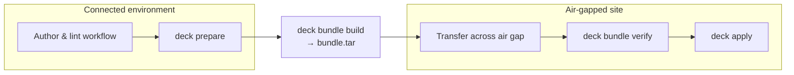

# deck 라이프사이클

`deck`은 모든 작업을 세 가지 명시적 단계로 구성합니다: **prepare**(연결 환경), **bundle**(밀봉된 전달 단위), **apply**(에어갭(망분리)). 이 라이프사이클을 이해하는 것이 이 도구에 대한 동작 가능한 멘탈 모델을 가장 빠르게 세우는 길입니다.

## 세 가지 단계



**Prepare**는 연결된 환경에서 실행됩니다. 운영자는 타입이 지정된 워크플로를 작성하고 린트한 다음, `deck prepare`를 실행하여 패키지, 이미지, 파일을 워크스페이스의 `outputs/` 트리로 다운로드합니다. 준비 작업은 apply에 사용되는 것과 동일한 타입 지정 워크플로 모델을 통해 선언됩니다 — 별도의 임시 다운로드 스크립트는 없습니다.

**Bundle**은 준비된 워크스페이스를 단일하고 자체 완결적인 아카이브(`bundle.tar`)로 변환합니다. 바이너리, 모든 워크플로 파일, 준비된 모든 아티팩트, 무결성 매니페스트가 함께 패킹됩니다. 이 단계 이후로는 외부 연결이 전혀 필요하지 않습니다.

**Apply**는 에어갭(망분리) 내부의 대상 노드에서 로컬로 실행됩니다. 운영자는 번들을 풀고, 선택적으로 `deck bundle verify`로 검증한 다음, `deck apply`를 실행합니다. 워크플로는 번들에 포함된 것만 사용하여 노드에서 전적으로 실행됩니다 — SSH도, 컨트롤러도, 외부 회신(reach-back)도 없습니다.

## 번들에 무엇이 담기며 그 이유는

| 번들 경로 | 목적 |
|---|---|
| `deck` | 런처 스크립트; `outputs/bin/`에서 플랫폼별 바이너리를 선택 |
| `outputs/bin/<os>/<arch>/deck` | 오프라인 실행용 deck 런타임 바이너리 — 대상에 설치 불필요 |
| `workflows/` | 시나리오, 컴포넌트 프래그먼트, 변수 파일 — 운영자가 실행할 워크플로 |
| `outputs/files/` | prepare 중 다운로드되거나 스테이징된 파일(설정 파일, 바이너리 등) |
| `outputs/packages/` | prepare 중 가져온 OS 패키지(`.rpm`, `.deb`, Kubernetes 패키지) |
| `outputs/images/` | prepare 중 가져온 컨테이너 이미지 아카이브 |
| `.deck/manifest.json` | SHA-256 무결성 매니페스트; `deck bundle verify`와 `deck apply` 모두 작업 시작 전에 이를 확인 |

워크플로가 대상 머신에서 필요로 하는 모든 것은 번들 안에 있어야 합니다. 스텝이 apply 시점에 파일을 필요로 한다면, 그것은 `outputs/`에서 와야 합니다 — 대상 노드는 어떤 외부 소스에도 회신할 필요가 없어야 합니다.

## 워크스페이스 vs. 번들

이것이 가장 흔한 혼동 지점입니다.

**워크스페이스**는 작성용 디렉터리입니다 — 번들링 전에 작업하는 라이브 디렉터리입니다. `deck init`으로 생성되며 표준 `workflows/`, `outputs/`, `.deck/` 레이아웃을 가집니다. 워크스페이스는 워크플로를 편집하고 `prepare`를 실행하며 반복 작업을 진행함에 따라 변화합니다. 전체 구조는 [Workspace Layout](../workspace-layout.md)을 참조하세요.

**번들**은 `deck bundle build`로 생성되는 밀봉되고 운반 가능한 아티팩트입니다. 단일 `bundle.tar` 아카이브(또는 대상에서 추출한 후의 풀린 번들 루트 디렉터리)입니다. 일단 빌드되면 번들은 불변으로 취급됩니다: apply가 시작되기 전에 무결성 매니페스트가 확인됩니다. 정확한 내용과 검증 규칙은 [Bundle Layout](../bundle-layout.md)을 참조하세요.

| | 워크스페이스 | 번들 |
|---|---|---|
| 상태 | 가변 — 여기서 작성하고 준비 | 불변 — 운반을 위해 밀봉 |
| 위치 | 연결 환경 | 에어갭(망분리)을 넘나듦 |
| 생성 | `deck init` | `deck bundle build` |
| 사용 | `deck lint`, `deck prepare` | `deck bundle verify`, `deck apply` |

## 역할 분리

`deck`은 `workflows/` 디렉터리에서 워크플로 로직을 세 가지 별개의 역할로 나눕니다:

- **`workflows/prepare.yaml`** — prepare 워크플로. 연결된 쪽에서 실행됩니다. 에어갭(망분리)을 넘기 전에 가져와야 할 것들을 선언합니다: 패키지, 이미지, 파일, 바이너리.
- **`workflows/scenarios/`** — 시나리오 파일. 각각은 실제 운영 작업을 기술하는 완전한 apply 워크플로입니다(예: `apply.yaml`, `bootstrap.yaml`, `worker-join.yaml`). 시나리오는 `deck apply`의 운영자 대면 진입점입니다.
- **`workflows/components/`** — 컴포넌트 프래그먼트. 시나리오가 임포트하는 재사용 가능한 스텝 목록입니다. `steps:` 목록만 포함하며 독립 진입 역할은 없습니다. 시나리오는 `phases[].imports`를 통해 이들을 가져옵니다.

시나리오는 다음과 같이 컴포넌트를 임포트합니다:

```yaml
# workflows/scenarios/apply.yaml
version: v1alpha1
phases:
  - name: host-prereqs
    imports:
      - path: k8s/prereq.yaml        # resolves to workflows/components/k8s/prereq.yaml
      - path: repo/offline-repo.yaml
  - name: runtime
    imports:
      - path: k8s/containerd-kubelet.yaml
```

컴포넌트 파일(`workflows/components/k8s/prereq.yaml`)은 스텝만 포함하며 직접 실행되는 대신 임포트됩니다. 이는 컴포넌트를 특정 시나리오의 변수 형태에 결합시키지 않으면서 공유 로직을 한곳에 유지합니다.

## 에어갭(망분리)을 넘기 전 운영자 체크리스트

1. **Lint** — 준비에 시간을 투자하기 전에 `deck lint`(또는 `deck lint --workflow ./workflows/scenarios/apply.yaml`)를 실행하여 워크플로 구조와 스텝 스키마를 검증합니다.
2. **Prepare** — 워크스페이스 루트에서 `deck prepare`를 실행하여 모든 아티팩트를 `outputs/`로 다운로드하고 `.deck/manifest.json`을 작성합니다.
3. **Bundle build** — `deck bundle build --out ./bundle.tar`를 실행하여 밀봉된 아카이브를 생성합니다.
4. **Verify (연결된 쪽, 선택)** — 운반 전에 `deck bundle verify ./bundle.tar`를 실행하여 아카이브가 완전하고 매니페스트가 일관성 있는지 확인합니다.
5. **Transport** — 사용 가능한 물리적 또는 단방향 전송 방식으로 `bundle.tar`를 에어갭(망분리)을 넘어 운반합니다.
6. **Verify (대상 쪽)** — 풀어낸 후 `deck bundle verify <bundle-root>`를 실행하여 무결성이 운반 과정에서 유지되었는지 확인합니다.
7. **Apply** — 번들 루트에서 `deck apply`(또는 `deck apply --scenario <name>`)를 실행합니다. 어떤 단계가 시작되기 전에 매니페스트가 자동으로 확인됩니다.

## 관련 참조

- [Workspace Layout](../workspace-layout.md)
- [Bundle Layout](../bundle-layout.md)
- [Workflow Model](../workflow-model.md)
- [Quick start](../quick-start.md)
- [Offline Kubernetes tutorial](../offline-kubernetes.md)
